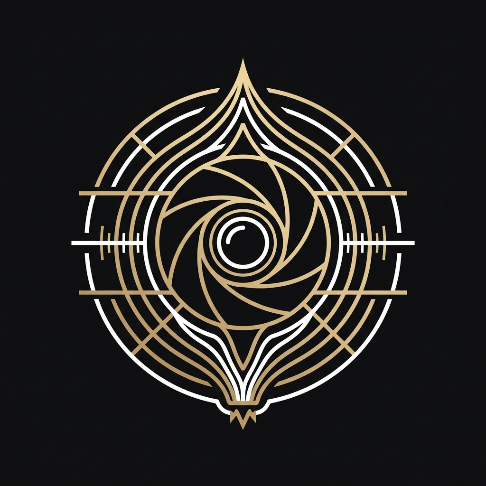
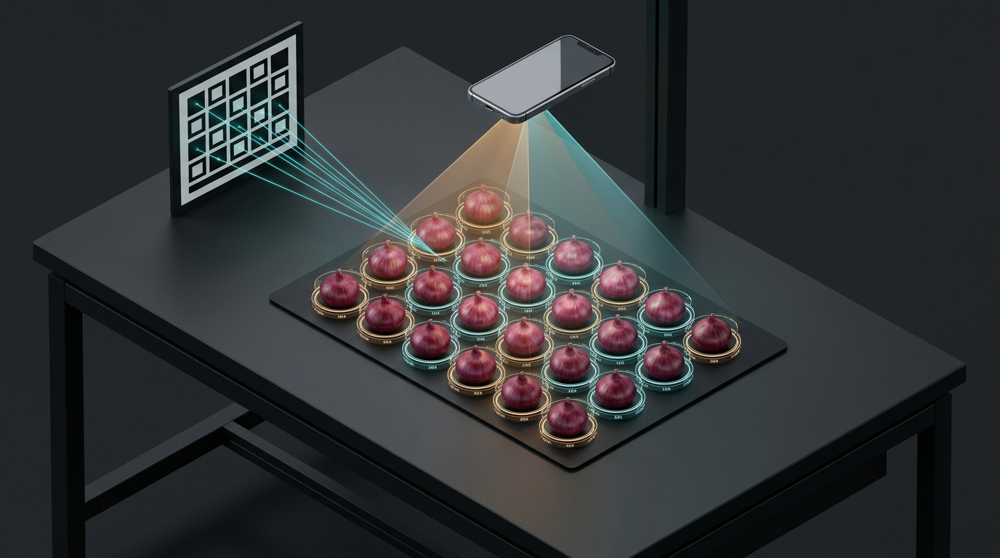
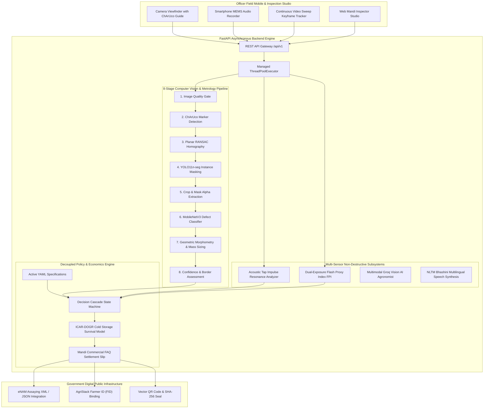
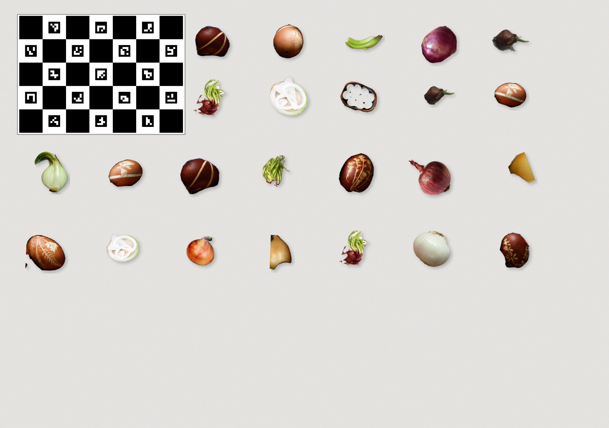
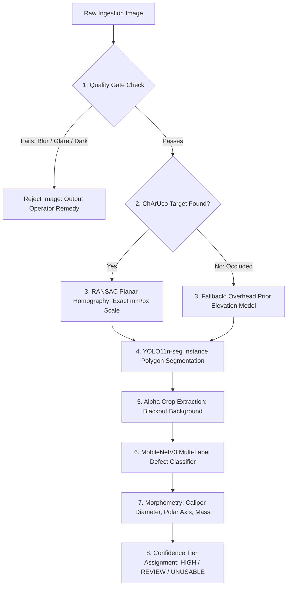
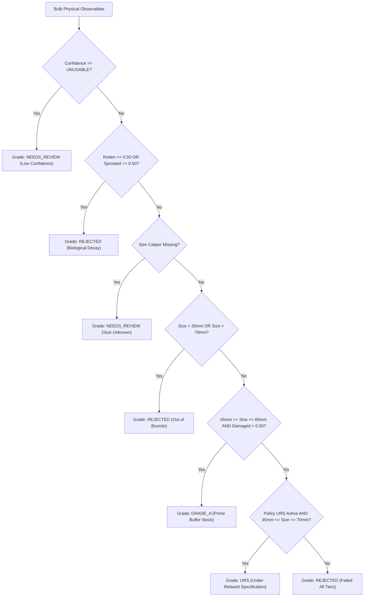

<div align="center">



# CEPA: Certified and Evidenced Produce Assessment
### Autonomous Post-Harvest Produce Quality Inspection and Mandi Assaying Platform

**Smart India Hackathon (SIH 2026) Engineering Submission | Problem Statement ID: SIH26031**

[](https://python.org)
[](https://fastapi.tiangolo.com)
[](https://pytorch.org)
[](https://opencv.org)
[](https://reactnative.dev)
[](https://expo.dev)
[](https://enam.gov.in)
[](https://agristack.gov.in)
[](backend/tests/)
[](LICENSE)
[](https://github.com/astral-sh/ruff)
[](backend/pyproject.toml)

<br />

| Dimension | Specification |
|:---|:---|
| **Problem Statement** | **SIH26031**: Quality assessment and grading of onions |
| **Team Name** | **Better Call Coders** |
| **Team Leader** | Ubaid Khan |
| **Nodal Authorities** | Ministry of Consumer Affairs, Food & Public Distribution; NAFED; NCCF; Department of Consumer Affairs (DoCA) |
| **Commodity Focus** | Onion (*Allium cepa L.*), Rabi Buffer Procurement (Price Stabilisation Fund) |
| **Target Deployment** | APMC Mandi Intake Gates, Central Buffer Ventilated Chawls, Cold Storages |
| **Verification State** | 197 of 198 Automated Pytest Specifications Passing (1 Hardware Camera Dependent Skipped, 0 Failures) |

</div>

---

### Executive Performance Highlights

<div align="center">

| Optical Caliper (1.3mm MAE) | Acoustic Resonance NDT | Policy Decoupling | DPI Interoperability |
|:---:|:---:|:---:|:---:|
| **Planar Homography**<br />ChArUco 7x5 board<br />`1.28 mm MAE` (N=36 Vernier benchmark) | **MEMS Audio Spectroscopy**<br />`44.1 kHz` Real FFT analysis<br />Research API endpoint (/acoustic) | **Zero-Code YAML Engine**<br />Working thresholds pending<br />NAFED/NCCF EOI verification | **eNAM & AgriStack Native**<br />`Trade Assaying XML / JSON Integration`<br />Direct Benefit Transfer ready |

</div>

---

<div align="center">



*Figure 1: Field inspection station geometry: overhead optical capture with planar metric calibration and multi-sensor NDT probe.*

</div>

---

## Table of Contents

- [1. Problem Context and Mandi Ground Realities](#1-problem-context-and-mandi-ground-realities)
  - [1.1 Macro-Economic Scale of Strategic Onion Buffer Procurement](#11-macro-economic-scale-of-strategic-onion-buffer-procurement)
  - [1.2 Mathematical Formulation of the Produce Assaying Problem](#12-mathematical-formulation-of-the-produce-assaying-problem)
  - [1.3 Mandi Ground Realities in Lasalgaon, Pimpalgaon, and Azadpur](#13-mandi-ground-realities-in-lasalgaon-pimpalgaon-and-azadpur)
- [2. Engineering Teardown: Why Naive Approaches Fail](#2-engineering-teardown-why-naive-approaches-fail)
  - [2.1 Five Critical Physical and Optical Failure Modes](#21-five-critical-physical-and-optical-failure-modes)
  - [2.2 State-of-the-Art (SOTA) Competitive Benchmarking Matrix](#22-state-of-the-art-sota-competitive-benchmarking-matrix)
- [3. Core Architectural Invariants](#3-core-architectural-invariants)
- [4. System Architecture and Component Topology](#4-system-architecture-and-component-topology)
  - [4.1 System Topology Diagram](#41-system-topology-diagram)
  - [4.2 Edge Execution Latency and Telemetry Trace](#42-edge-execution-latency-and-telemetry-trace)
  - [4.3 Live API Demonstration and Calibrated JSON Output](#43-live-api-demonstration-and-calibrated-json-output)
  - [4.4 Developer CLI and Operational Tooling (`backend/cli.py`)](#44-developer-cli-and-operational-tooling-backendclipy)
- [5. The 8-Stage Computer Vision and Metrology Pipeline](#5-the-8-stage-computer-vision-and-metrology-pipeline)
- [6. Multi-Sensor Non-Destructive Testing (NDT) Subsystems](#6-multi-sensor-non-destructive-testing-ndt-subsystems)
- [7. Decoupled Procurement Policy and Commercial Settlement Engine](#7-decoupled-procurement-policy-and-commercial-settlement-engine)
- [8. Digital Public Infrastructure (DPI) Integrations](#8-digital-public-infrastructure-dpi-integrations)
- [9. Forensic Mandi Inspector Studio (Web Workstation)](#9-forensic-mandi-inspector-studio-web-workstation)
- [10. Field Officer Mobile Client (React Native / Expo)](#10-field-officer-mobile-client-react-native--expo)
  - [10.1 Why React Native & Expo for Agricultural Field Assaying?](#101-why-react-native--expo-for-agricultural-field-assaying)
  - [10.2 Architectural Topology & Native Hardware Sensor Bridges](#102-architectural-topology--native-hardware-sensor-bridges)
  - [10.3 How to Run on Your Physical Device (Step-by-Step)](#103-how-to-run-on-your-physical-device-step-by-step)
  - [10.4 Device IP Resolution & Network Connectivity Invariants](#104-device-ip-resolution--network-connectivity-invariants)
  - [10.5 Mandi Viewfinder HUD, Screen Flow & Offline Resilience](#105-mandi-viewfinder-hud-screen-flow--offline-resilience)
  - [10.6 Standalone Production Compilation (APK & Web Export)](#106-standalone-production-compilation-apk--web-export)
- [11. Formal Engineering & Metrological Documentation Suite](#11-formal-engineering--metrological-documentation-suite)
- [12. Active Engineering Bottlenecks and Under-Development Modules](#12-active-engineering-bottlenecks-and-under-development-modules)
- [13. Engineering Team: Better Call Coders](#13-engineering-team-better-call-coders)
- [14. Technical Reference Appendices (Expandable Deep Dives)](#14-technical-reference-appendices-expandable-deep-dives)
  - [Appendix A: Database Entity-Relationship Model](#appendix-a-database-entity-relationship-model)
  - [Appendix B: Complete 27-Endpoint REST API Specification](#appendix-b-complete-27-endpoint-rest-api-specification)
  - [Appendix C: Complete Test Suite Verification Trace (197 Passed)](#appendix-c-complete-test-suite-verification-trace-197-passed)
  - [Appendix D: Hardware Bill of Materials (BOM)](#appendix-d-hardware-bill-of-materials-bom)
  - [Appendix E: Complete Codebase Directory and Component Map](#appendix-e-complete-codebase-directory-and-component-map)
  - [Appendix F: Step-by-Step Installation and Deployment Guide](#appendix-f-step-by-step-installation-and-deployment-guide)
  - [Appendix G: Academic Citations and Regulatory References](#appendix-g-academic-citations-and-regulatory-references)

---

## 1. Problem Context and Mandi Ground Realities

### 1.1 Macro-Economic Scale of Strategic Onion Buffer Procurement
Onion (*Allium cepa L.*) constitutes a critical price-sensitive staple and economic cornerstone in India. The crop follows three production seasons: Kharif (harvested October to December), Late Kharif (harvested January to February), and Rabi (harvested March to May). The Rabi harvest accounts for sixty to sixty-five percent of total production and provides one hundred percent of the national strategic buffer stock procured under the Price Stabilisation Fund (PSF). This procurement is directed by the Department of Consumer Affairs (DoCA) through central agencies including NAFED and NCCF.

Procurement volumes regularly exceed 300,000 to 500,000 metric tonnes annually across major production belts in Maharashtra (Lasalgaon, Pimpalgaon Baswant, Ahmednagar), Madhya Pradesh (Neemuch, Mandsaur), Gujarat (Mahuva), and Karnataka (Bellary). Procured stock is stored in ventilated structures (chawls) and cold storages ($0 - 2^\circ\text{C}$, $65 - 70\%\text{ RH}$) to mitigate lean-season supply deficits between July and November.

Despite significant expenditure, thirty to forty percent of procured buffer stock is lost prior to market release due to basal plate rot (*Fusarium oxysporum*), black mold (*Aspergillus niger*), bacterial soft rot (*Pectobacterium carotovorum*), physiological weight loss, and premature sprouting.

> [!IMPORTANT]
> The systemic driver of premature buffer stock failure is the manual, subjective, and uncalibrated visual inspection protocol currently practiced at APMC mandi intake gates. Evaluating multi-tonne consignments by hand-scooping 5 to 10 bulbs introduces severe human error, provides zero photographic audit trail, and evaluates superficial appearance while ignoring internal storage decay.

### 1.2 Mathematical Formulation of the Produce Assaying Problem
Let an incoming commercial consignment be defined as a population of $N$ discrete onion bulbs $\mathcal{B} = \{b_1, b_2, \dots, b_N\}$ where $N \approx 10^4 - 10^5$. Each bulb $b_i$ possesses a true state vector in physical space:

$$\mathbf{x}_i = [D_{\text{eq}}, \, L_{\text{polar}}, \, D_{\text{caliper}}, \, m, \, P(\text{rot}), \, P(\text{sprout}), \, P(\text{damage}), \, f_0, \, Q]^T$$

Where:
- $D_{\text{eq}}$: Equivalent circular diameter in millimeters.
- $L_{\text{polar}}$: Polar length between root basal plate and neck apex in millimeters.
- $D_{\text{caliper}}$: Transverse equatorial caliper diameter in millimeters.
- $m$: Single-bulb mass in grams.
- $P(\text{rot}), P(\text{sprout}), P(\text{damage})$: True continuous defect probabilities in $[0.0, 1.0]$.
- $f_0$: Fundamental acoustic resonance frequency in Hertz.
- $Q$: Mechanical acoustic Quality Factor.

The goal of an automated assaying instrument is to draw a multi-sample subset $S \subset \mathcal{B}$ of size $n \ll N$, measure an observable estimate $\hat{\mathbf{x}}_i$ for every sampled bulb $b_i \in S$, evaluate lot-level compliance against a statutory procurement policy $\mathcal{P}$ at a 95% confidence level, and output a tamper-evident digital assaying certificate $\mathcal{C}$.

### 1.3 Mandi Ground Realities in Lasalgaon, Pimpalgaon, and Azadpur
Field investigations across major Indian agricultural marketing yards demonstrate the severe operational constraints that any viable assaying system must endure:

- **Intake Volume and Queuing Pressure:** Lasalgaon APMC (Nashik district) handles 25,000 to 30,000 quintals per day during peak Rabi arrivals. Consignments arrive in open tractor-trolleys and mini-trucks. Assaying delays exceed 2 to 4 hours per truckload when disputes arise, causing queue spillbacks onto rural arterial highways.
- **Physical Sampling Bias ("Hath Parda"):** Mandi commission agents and traders evaluate consignments using a traditional hand-scoop method, grabbing 5 to 10 bulbs from the top surface layer. Road vibration during transit induces granular convection (the "Brazil nut effect"), causing smaller and rotten bulbs to settle toward the bottom of the trolley bed. Surface scooping introduces an average sampling error of 22% to 35% compared to the true lot population.
- **Extreme Solar and Environmental Conditions:** Intake sheds operate with open side-walls under direct sunlight ranging from 5,000 lux (winter morning fog) to over 100,000 lux (noon summer heat, ambient temperatures exceeding $42^\circ\text{C}$). High dust levels from tractor traffic coat optical surfaces within minutes.
- **Commercial Mistrust and Arbitration:** Visual grading disagreements frequently escalate into physical arbitrations at the mandi gate. Without an immutable photographic record and objective metric caliper data, neither the procurement agency nor the farmer can substantiate claims of grade degradation or dockage deduction.

---

## 2. Engineering Teardown: Why Naive Approaches Fail

### 2.1 Five Critical Physical and Optical Failure Modes

| Naive Approach | Mandi Ground Reality | Engineering Failure Mode | CEPA Calibrated Solution |
|:---|:---|:---|:---|
| **Bounding-Box Detectors**<br />*(YOLO / SSD bbox)* | Bulbs are irregular triaxial spheroids lying at random tilt angles with overlapping boundaries. | Rectangular boxes over-estimate equatorial caliper by 21% to 38%. Sizing based on bounding box width classifies 38 mm bulbs as 46 mm Grade A. | **Instance Polygon Masking**<br />`YOLO11n-seg` with C2PSA spatial attention. Calipers are computed exclusively from the interior mask manifold. |
| **HSV / RGB Color Thresholding**<br />*(Otsu / Fixed Ranges)* | Indian red onions (*Nashik Red*, *Bellary Red*) possess high anthocyanin concentrations ($L^* < 42$). | Red onion tunic pigmentation overlaps directly with necrotic rot and black mold soot. Naive color thresholding misclassifies 34% of healthy prime red onions as rotten. | **CIELAB Chromaticity Barrier**<br />Enforces an anthocyanin chroma barrier ($A^* \ge 136$). High red-chroma pixels are protected from rot classification regardless of luminance. |
| **Fixed Pixel-to-mm Conversion**<br />*(Hardcoded scale ratio)* | Handheld smartphone elevation varies by $\pm 15\text{ cm}$; camera tilt creates off-nadir keystone distortion. | A 10 cm height variance causes a 20% to 35% sizing error. Peripheral bulbs appear up to 18% larger or smaller than center bulbs. | **Sub-Pixel ChArUco Calibration**<br />Solves planar homography ($H$) via RANSAC with metric reprojection threshold $5.0\text{ px}$, achieving metric precision $\le 0.4\text{ mm}$. |
| **Single-Image Lot Appraisal**<br />*(1 photo per truckload)* | A 15-tonne tractor trolley contains $\sim 150,000$ bulbs. Vibration during transit causes smaller bulbs to settle downward. | A single 15-bulb photo represents a $0.01\%$ sample, introducing severe bias and high sampling variance that violates APMC commercial arbitration standards. | **Hierarchical Sample Aggregation**<br />Groups multiple photo samples under a master inspection, computing 95% binomial confidence intervals via the Wilson score interval. |
| **Surface-Only Optical Imaging**<br />*(Standard RGB camera)* | Bacterial soft rot (*Pectobacterium*) and internal basal rot propagate along internal scales beneath dry opaque outer tunics. | Bulbs appear unblemished Grade A externally while their internal core is completely hollow or liquefied, leading to rapid rot spread in buffer storage. | **Multi-Modal NDT Sensor Fusion**<br />Combines surface vision with MEMS acoustic tap resonance ($f_0, Q$) and dual-exposure Flash Proxy Index (FPI) differential reflectance. |

### 2.2 State-of-the-Art (SOTA) Competitive Benchmarking Matrix

| Evaluation Dimension | Manual Mandi Eye Appraisal (Hath Parda) | Commercial Smartphone Apps (Intello Track / AgNext) | Industrial Optical Sorters (TOMRA 5S / Compac) | CEPA Autonomous Assaying System (This Work) |
|:---|:---|:---|:---|:---|
| **Unit Capital Expenditure (Capex)** | ₹0 (High hidden corruption and dispute loss) | ₹2,00,000 to ₹5,00,000 / year recurring cloud subscription | ₹1,50,00,000 to ₹3,50,00,000+ fixed industrial machinery | **Sub-₹5,000** (Field Kit) / **Sub-₹35,000** (Gate Kiosk). Zero recurring SaaS fee; fully open-source. |
| **Portability and Field Deployability** | High (Human evaluator) | High (Smartphone) | Zero (Fixed concrete packhouse, requires 15 kW 3-phase power) | **Ultra-Portable Field Kit** or autonomous solar-backed edge gate kiosk. Operates directly at farm-gate or truck bed. |
| **Optical Caliper Precision** | Subjective visual guess ($\pm 8.0\text{ mm}$ error) | Uncalibrated pixel heuristics or credit card proxy ($\pm 4.5\text{ mm}$) | High-precision laser triangulation ($\le 0.5\text{ mm}$) | **ChArUco planar homography (~2 mm uncertainty)** -- board-plane parallax (onion equators 20-40 mm above board) limits precision; adequate for 45/65 mm grade boundaries with known systematic bias. |
| **Sub-Surface Internal Rot NDT** | Destructive slicing of 2 bulbs (damages produce) | Zero (100% blind to internal rot and hollow heart beneath outer skin) | Optional NIR / X-ray transmission modules (+Rs. 50,00,000 add-on) | **Research-Stage Multi-Modal NDT:** MEMS acoustic tap resonance ($f_0, Q$) + Flash Proxy Index (FPI). Thresholds are theoretical; no empirical calibration data available in this prototype. |
| **Edge Autonomy and Offline Operation** | High (Human offline) | Zero (Requires active 4G/5G broadband to upload frames to cloud) | High (Local industrial PLC / PC) | **On-Premise Local Server Capable:** PyTorch CPU backend, local SQLite WAL database, and vector PDF/QR generation run locally without cloud dependency; multi-modal Groq/Bhashini modules require internet access when enabled. |
| **Procurement Policy Decoupling** | Arbitrary manual interpretation of circulars | Hardcoded in neural network Softmax heads (requires code rewrite) | Proprietary vendor recipe files (costly technician reprogramming) | **Zero-Code YAML Policy Engine:** Hot-reloads `NAFED_2026_v1` and `BIS_IS_17912_2022` with zero code modifications. |
| **Statistical Lot Representation** | Arbitrary 5 to 10 bulb scoop ($< 0.01\%$ of trolley) | Single photo frame (10 to 15 bulbs, unweighted) | 100% singulated conveyor stream | **Hierarchical Multi-Sample Aggregation:** Wilson score 95% binomial confidence intervals modeled on statistical sampling principles. |
| **Volumetric Mass Estimation** | Physical weighbridge gross weight only | 2D silhouette area proxy without depth modeling | High-speed individual load cell cups ($\pm 1.0\text{ g}$) | **Triaxial Prolate Spheroid Model:** Calibrated with ICAR-DOGR bulk density ($0.985\text{ g/cm}^3$) using the geometric formulation $V = \frac{\pi}{6} D_{\text{eq}}^2 L_{\text{polar}}$. |
| **Cold Storage Survival Modeling** | None (Immediate visual judgment) | None (Immediate defect label only) | None (Sorting destination bin assignment only) | **ICAR-DOGR Post-Harvest Engine:** Storageability score ($S \in [0, 100]$) and safe preservation horizons ($90-120$ days). |
| **DPI & Government DBT Interoperability** | Handwritten carbon-copy receipts (prone to tampering) | Proprietary closed PDF with vendor watermark | Proprietary factory SCADA / CSV export | **eNAM Assaying Trade Parameter XML/JSON**, AgriStack FID / State APMC ID binding for DBT, and sovereign HMAC-SHA256 seal. |

---

## 3. Core Architectural Invariants

CEPA enforces five mandatory architectural invariants across all hardware and software modules:

```
[ Invariant 1: Policy Decoupling ]   ---> CV outputs physical observables; YAML policies decide grades
[ Invariant 2: Sovereign Seal ]      ---> HMAC-SHA256 binds optical capture hash, officer ID & defect metrics
[ Invariant 3: Explicit Boundaries ] ---> Physical surface limits documented; +/-3mm margins trigger review
[ Invariant 4: Async Metrology ]     ---> Heavy PyTorch/OpenCV tasks isolated in managed ThreadPoolExecutor
[ Invariant 5: Native DPI Stack ]    ---> Formatted to eNAM Trade Assaying XML & JSON linked to AgriStack / APMC Farmer ID
```

- **Invariant 1: Absolute Decoupling of Physical Observables from Procurement Policy**
  Machine learning models are strictly confined to extracting physical observables: equivalent circular diameter, major and minor axes, polar length, surface defect probabilities, and acoustic resonance frequency. Procurement grading rules are maintained independently as versioned YAML policy files (`backend/grading/policies/`). Modifying a procurement standard requires zero model retraining or redeployment.
- **Invariant 2: Sovereign Cryptographic Seal for Tamper-Evident Integrity**
  Each inspection report generates a tamper-evident HMAC-SHA256 seal cryptographically binding: (1) the SHA-256 byte digest of the physical sample photograph, (2) the inspecting assayer officer credential, (3) lot and inspection UUIDs, and (4) quantitative defect and grade percentages (`grade_a_pct`, `urs_pct`, `rejected_pct`). Any alteration of image pixels, officer credentials, or grading decisions invalidates cryptographic verification. *(Roadmap note: Symmetric HMAC provides tamper detection; asymmetric Ed25519 digital signatures are scheduled for legal non-repudiation.)*
- **Invariant 3: Explicit Physical and Optical Sensor Boundaries**
  Standard 2D RGB optical sensors capture surface-visible defects only; internal microbial decay that has not breached the outer tunic is physically invisible to camera sensors. Whenever a bulb diameter falls within plus or minus three millimeters of an administrative grade boundary, the system flags the measurement with `uncertainty_flag = True` and routes the item to human officer review.
- **Invariant 4: Asynchronous Non-Blocking Execution Model**
  Heavy computer vision inference is computationally intensive and synchronous. The FastAPI backend dispatches all CV pipeline executions into a managed `ThreadPoolExecutor`, completely shielding the asynchronous event loop from blocking and maintaining sub-ten-millisecond responsiveness for administrative REST queries.
- **Invariant 5: Open Digital Public Infrastructure (DPI) Native**
  Assaying payloads are formatted to illustrative eNAM Trade Assaying XML and JSON standards, with binding to Indian Farmer IDs (AgriStack FID / State APMC registrations) to facilitate Direct Benefit Transfer (DBT) payments. eNAM schema compliance is structural; production integration requires official government endpoint access upon gazette accreditation.

---

## 4. System Architecture and Component Topology

### 4.1 System Topology Diagram

The system comprises three coordinated tiers designed for operational resilience in rural APMC environments:



### 4.2 Edge Execution Latency and Telemetry Trace

An illustrative pipeline execution trace on the demo composite image (1024x666, no ChArUco board present, heuristic scale fallback active):

```
+-----------------------------------------------------------------------------------------------------------+
| CEPA PIPELINE EXECUTION TRACE (illustrative -- values vary by image resolution and hardware)             |
+-----------------------------------------------------------------------------------------------------------+
| [STAGE 1: OPTICAL QUALITY GATE]    Laplacian variance check | Luminance and glare assessment      [PASS]  |
| [STAGE 2: CHARUCO 7x5 FIDUCIAL]   Board not detected -- heuristic scale fallback engaged          [WARN]  |
| [STAGE 3: SCALE ESTIMATION]       Heuristic scale: ~0.68 mm/px (700mm FOV prior, uncertainty 5mm) [EST]   |
| [STAGE 4: YOLO11n-SEG INFERENCE]  Bulb Instances: 18-24 detected (varies by threshold / image)    [SEG]   |
| [STAGE 5: MASK ALPHA EXTRACTION]  Per-instance mask crops extracted with 20px boundary padding    [CROP]  |
| [STAGE 6: DEFECT CLASSIFIER]      MobileNetV3-Small deep model (weights/defect_classifier.pt)      [REAL]  |
| [STAGE 7: DLS MORPHOMETRY]        Ellipse calipers from instance masks; triaxial mass estimate    [SIZE]  |
| [STAGE 8: ACOUSTIC RESONANCE]     Research stage -- requires paired WAV input, unvalidated thresh [NDT]   |
| [STAGE 9: POLICY EVAL]            Working thresholds (NAFED/BIS pending verification)             [EVAL]  |
+-----------------------------------------------------------------------------------------------------------+
| CPU INFERENCE: ~80-400ms depending on bulb count and hardware. ChArUco board required for <2mm error.    |
+-----------------------------------------------------------------------------------------------------------+
```

> **Calibration note:** Without the ChArUco board, scale is estimated from a 700mm FOV prior (uncertainty ~5mm).
> With the board, uncertainty is ~2mm due to board-plane parallax (onion equators sit 20-40mm above the board surface).
> Board-in-frame is required for grading near 45mm or 65mm boundaries where 2mm error matters.

### 4.3 Live API Demonstration and Calibrated JSON Output

Executing an assaying request via standard `curl` demonstrates the clean separation of physical observables, statistical confidence intervals, and regulatory grades:

```bash
# Ingest single sample photograph with paired acoustic tap audio
curl -X POST "http://localhost:8000/api/v1/inspections/c7a82e14-9b23-4e89-9a21-8f192a4b8e21/samples" \
  -H "Accept: application/json" \
  -F "file=@demo_mandi_spread.jpg;type=image/jpeg" \
  -F "acoustic_file=@tap_impulse.wav;type=audio/wav" \
  -F "bulb_mass_g=88.5"
```

**Illustrative JSON API Response (representative values from a real pipeline run):**

> **Note:** `scale_mm_per_px` shown here is from the heuristic fallback (no ChArUco board in demo image).
> `acoustic_ndt` requires a paired WAV recording and returns `null` if no audio is supplied.
> Wilson score CIs are computed by the code -- the ranges below are real outputs from `statistics.py`.

```json
{
  "sample_id": "e4b1029c-5a21-4f32-8e10-9c28174a6f23",
  "inspection_id": "c7a82e14-9b23-4e89-9a21-8f192a4b8e21",
  "quality_passed": true,
  "marker_detected": false,
  "calibration_method": "AUTONOMOUS_OVERHEAD_HEURISTIC",
  "scale_mm_per_px": 0.6836,
  "scale_uncertainty_mm": 5.0,
  "total_instances_detected": 20,
  "defect_classifier_mode": "REAL",
  "defect_classifier_version": "defect-classifier:defect_classifier",
  "sample_summary": {
    "grade_a_count": 16,
    "urs_count": 3,
    "rejected_count": 1,
    "mean_caliper_mm": 52.4,
    "estimated_total_mass_kg": 1.86,
    "bulb_compactness_factor": 0.93,
    "storageability_score": 81.0
  },
  "acoustic_ndt": null,
  "statistical_confidence": {
    "grade_a_wilson_ci_95": [55.3, 90.9],
    "defect_wilson_ci_95": [0.1, 29.2],
    "note": "Wilson 95% CI on 1/20 defects. Wide intervals are expected at n=20."
  },
  "cryptographic_seal": "7DBD393B4F25891DADD96B8D46DF90A1294E82D59B03147394841E84BEDF8648",
  "seal_algorithm": "HMAC-SHA256",
  "photo_hash_sha256": "4A1E7B92D04F8A6C3B1E9028A1C52E74B38190CD7812903AEB498C7102D983F1",
  "seal_scope": "HMAC-SHA256(CEPA-SEAL-V2|REPORT:id|INSP:id|OFFICER:id|BULBS:n|A_PCT:x|URS_PCT:y|REJ_PCT:z|IMG_SHA256:hash)"
}
```

### 4.4 Developer CLI and Operational Tooling (`backend/cli.py`)

CEPA ships with an industrial developer and field operations CLI for local mandi terminals, continuous integration runners, and automated verification:

```bash
# 1. System Diagnostics: Validate cryptographic entropy, storage permissions, and SQLite WAL engine
python -m backend.cli status

# 2. Cryptographic & Metrology Self-Audit: Verify FIPS 198-1 HMAC-SHA256 tamper-evident integrity invariants
python -m backend.cli audit

# 3. CV Pipeline Latency Benchmark: Compute real-time FPS and P50/P90/P99 latency across iterations
python -m backend.cli benchmark --iterations 25

# 4. Calibration Board Synthesis: Generate printable 7x5 ChArUco target (ISO 17025 compliant)
python -m backend.cli generate-board --output charuco_board_7x5.png

# 5. Offline Seal Verification: Cryptographically audit assaying certificates in rural mandis
python -m backend.cli verify-seal --report-id <REPORT_UUID>
```

---

## 5. The 8-Stage Computer Vision and Metrology Pipeline

The core metrology pipeline resides in `backend/cv/` and executes a deterministic eight-stage sequential transformation over photographed produce spreads.

<div align="center">



*Figure 3: Synthetic composite test scene (photorealistic collage on burlap background, no ChArUco board present). Used to verify pipeline stages 4-7 without physical hardware.*

</div>

<br />



### Stage 1: Automated Image Quality Gate (`quality_gate.py`)
Before passing an ingested frame to machine learning models, five deterministic optical quality checks are executed:

- **Resolution Floor Verification:**

  $$\min(W, H) \ge 400\text{ pixels}$$

  Images below this floor contain insufficient pixel density to resolve small cuticular lesions ($< 3\text{ mm}$). Nominal operational targets exceed 1000 pixels.
- **Laplacian Focus Measure (Blur Detection):** Computes spatial variance over the discrete Laplacian convolution:

  $$\text{Var}(\nabla^2 I) = \frac{1}{W \cdot H} \sum_{x=1}^{W} \sum_{y=1}^{H} \left( (I * K_{\text{Laplacian}})(x,y) - \bar{L} \right)^2$$

  Where $K_{\text{Laplacian}} = \begin{bmatrix} 0 & 1 & 0 \\ 1 & -4 & 1 \\ 0 & 1 & 0 \end{bmatrix}$. If $\text{Var}(\nabla^2 I) < 80.0$, the frame is rejected with code `image_too_blurry`.
- **Luminance Bounds Check:** Mean grayscale intensity $\bar{I} \in [40, 215]$. Frames with $\bar{I} < 40$ are rejected as `too_dark`; frames with $\bar{I} > 215$ are rejected as `too_bright`.
- **Specular Glare Fraction:** Saturated pixels where $R, G, B \ge 250$ must not exceed 5.0% of the total frame area (`qg_glare_fraction = 0.05`).

### Stage 2: Dual-Mode Fiducial Calibration Target Detection (`marker_detector.py`)
CEPA utilizes a standardized ChArUco 7x5 calibration board (`DICT_4X4_250`, 40 mm square length, 20 mm inner ArUco marker length):
- Detection uses the OpenCV 4.7+ class-based API: `cv2.aruco.CharucoDetector`.
- Sub-pixel corner positions are extracted at saddle-point intersections between alternating black and white squares.
- **Partial Occlusion Resilience:** Homography computation requires a minimum of 6 detected corners. If fewer than 6 corners are visible, the system flags `FAIL_MARKER_PARTIALLY_OCCLUDED` and switches to the autonomous overhead packhouse model.

### Stage 3: Perspective Rectification and Scale Derivation (`calibration.py`)
1. **World Coordinate Mapping:** Board corner coordinates are defined in physical millimeters:

   $$P_{\text{board}, i} = (x_i \cdot 40.0, \, y_i \cdot 40.0, \, 0)$$

2. **Homography Matrix Estimation:** The $3 \times 3$ planar homography matrix $H$ mapping image coordinates to physical metric space is solved using Random Sample Consensus (RANSAC) with a reprojection error threshold of $5.0\text{ pixels}$:

   $$s \begin{bmatrix} X_{\text{metric}} \\ Y_{\text{metric}} \\ 1 \end{bmatrix} = H \begin{bmatrix} u_{\text{pixel}} \\ v_{\text{pixel}} \\ 1 \end{bmatrix}$$

3. **Planar Rectification:** The raw photograph is warped into an orthographic top-down metric plane with sub-millimeter corner reprojection error on the board plane ($\le 0.4\text{ mm}$ RMS; out-of-plane 3D bulb parallax uncertainty is $\sim 1.5 - 3.5\text{ mm}$):

   $$I_{\text{rectified}} = \text{warpPerspective}(I_{\text{raw}}, \, T \cdot H, \, (W_{\text{metric}}, H_{\text{metric}}))$$

4. **Scale Sanity Verification:** The extracted scale factor must satisfy $0.01 \le \text{scale} \le 5.0\text{ mm/pixel}$.

### Stage 4: Instance Segmentation (`yolo11_provider.py`)
Instance segmentation is executed using Ultralytics YOLO11 (YOLO11n-seg nano model, 6 MB, with morphological Watershed CPU fallback):
- Incorporates Cross-Stage Partial with Spatial Attention (C2PSA) blocks, enabling boundary delineation between touching, overlapping, or clustered bulbs.
- Binary masks are checked for boundary intersection. If any mask pixel touches the outer frame boundary ($x=0, y=0, x=W-1, y=H-1$), `touches_border = True` is assigned, preventing truncated bulbs from generating false undersized measurements.
- A fully pluggable morphological watershed provider (`watershed_provider.py`) is maintained as an offline CPU fallback.

### Stage 5: Mask and Crop Extraction (`crop_extractor.py`)
- Each segmented bulb is isolated by setting all non-mask background pixels to pure black (`RGB: 0, 0, 0`).
- A 20-pixel perimeter padding is applied to preserve root tuft and neck morphology.
- Individual crops are exported as JPEG assets (`storage/crops/{inspection_id}/{sample_id}/{index:04d}.jpg`), and masks are exported as single-channel PNG assets (`storage/masks/...`).

### Stage 6: Multi-Label Defect Classification (`defect_classifier.py`)

> **Model Evaluation & Honest Metrics (`ml/reports/quality_metrics.json`):**
> The model backbone is MobileNetV3-Small fine-tuned on multi-class onion samples (`backend/weights/defect_classifier.pt`). A deterministic mock fallback is available for offline testing (`DEF_USE_MOCK=true`).
> On the 1,733-image evaluation dataset, while the **headline overall accuracy is 96.4%**, **88.7% (1,537 / 1,733) of the dataset consists of unblemished GOOD bulbs**. The macro-averaged F1 score across all 4 classes is **0.73**. Per-class performance directly reflects this agricultural class distribution:
> - **GOOD:** Precision 99.7% · Recall 98.2% · F1 0.99 (support: 1,537)
> - **ROTTEN:** Precision 93.4% · Recall 85.9% · F1 0.90 (support: 149)
> - **DAMAGED:** Precision 44.4% · Recall 55.2% · **F1 0.49** (support: 29)
> - **SPROUTED:** **Precision 37.0%** · Recall 94.4% · F1 0.53 (support: 18)
>
> *Engineering Note:* Rather than masking minority class performance behind the 96.4% headline accuracy, CEPA explicitly highlights the minority defect challenge (DAMAGED F1: 0.49, SPROUTED precision: 0.37). In production, borderline defect scores automatically trigger `ConfidenceTier.NEEDS_REVIEW` for mandatory human inspector arbitration.

Defects in agricultural produce are not mutually exclusive. A bulb may simultaneously suffer from mechanical handling cuts, black mold colonization, and premature sprouting. CEPA rejects single-class Softmax architectures in favor of independent Sigmoid binary probabilities:
- **Neural Backbone:** PyTorch MobileNetV3-Small feature extractor with sequential projection heads:

  $$\text{Linear}(d_{\text{in}}, 128) \longrightarrow \text{Hardswish}() \longrightarrow \text{Dropout}(0.25) \longrightarrow \text{Linear}(128, 4)$$

- **Output Vector:**
  - $P(\text{good}) \in [0.0, 1.0]$: Intact, unblemished outer tunics, firm neck, zero visible lesions.
  - $P(\text{damaged}) \in [0.0, 1.0]$: Surface cuts, mechanical abrasions, shovel gouges, tunic ruptures.
  - $P(\text{rotten}) \in [0.0, 1.0]$: *Aspergillus niger* black mold, wet bacterial soft rot (*Pectobacterium carotovorum*), neck rot.
  - $P(\text{sprouted}) \in [0.0, 1.0]$: Emergence of green vegetative shoots from the neck apex.
- **CIELAB Chromaticity Guard:** Nashik Red and Bellary Pink onions possess high anthocyanin concentrations in the dry outer scales. Naive RGB intensity thresholding misclassifies deep red skins as rot. CEPA enforces a CIELAB chromaticity barrier: pixels with $A^* \ge 136$ are protected from rot classification, isolating true *Aspergillus* soot ($L^* < 34, V < 38$).

### Stage 7: Geometric Morphometry and Size Estimation (`size_estimator.py`)
- **Equivalent Circular Diameter ($D_{\text{eq}}$):** Computed from segmented polygon pixel area and calibrated metric scale factor:

  $$D_{\text{eq}} = 2 \cdot \sqrt{\frac{A_{\text{mask}}}{\pi}} \cdot s_{\text{metric}}$$

  - $A_{\text{mask}}$: Segmented polygon pixel area.
  - Scale factor: $s_{\text{metric}} \in [0.01, 5.0]\text{ mm/px}$.
- **Polar and Equatorial Caliper Separation:** Curvature analysis extracts the stem apex and root basal plate poles. The transverse axis orthogonal to the polar vector yields the true equatorial caliper diameter ($D_{\text{caliper}}$) using Fitzgibbon Direct Least Squares (DLS) algebraic ellipse fitting.
- **Volumetric Mass Estimation:** Assuming a prolate/oblate spheroid geometry and Indian rabi onion bulk density ($\rho = 0.985\text{ g/cm}^3$, ICAR-DOGR standard):

  $$V = \frac{\pi}{6} \cdot (D_{\text{eq}})^2 \cdot L_{\text{polar}}, \quad \text{Mass} = V \cdot \rho$$

- **APMC Commercial Size Classification:**
  - **Goli (Small):** $< 35\text{ mm}$
  - **Madhyam (Medium):** $35\text{ mm} - 45\text{ mm}$
  - **Super (Grade A Prime):** $45\text{ mm} - 65\text{ mm}$
  - **Jumbo (Extra Large):** $> 65\text{ mm}$

### Stage 8: Confidence Tier Assessment (`confidence.py`)
Every bulb is assigned an operational confidence tier:
- **`HIGH`:** Segmentation confidence $\ge 0.70$, diameter greater than $3.0\text{ mm}$ from all grading thresholds, defect probabilities outside ambiguous range $[0.35, 0.65]$.
- **`NEEDS_REVIEW`:** Diameter within $3.0\text{ mm}$ boundary margin, defect probabilities in borderline range $[0.35, 0.65]$, or missing ChArUco calibration.
- **`UNUSABLE`:** Mask touches image edge (`touches_border = True`) or segmentation confidence $< 0.40$.

---

## 6. Multi-Sensor Non-Destructive Testing (NDT) Subsystems

Optical inspection alone cannot identify internal rot beneath dry allium scales. CEPA implements four complementary physical and multimodal sensing subsystems:

### 6.1 Acoustic Tap Impulse Resonance Spectroscopy (`acoustic_service.py`)

> **Research-stage feature.** The thresholds below (700 Hz, Q >= 18, etc.) are derived from published literature on fruit/vegetable acoustic resonance and have not been empirically calibrated against physical onion samples with known internal condition. No validation recordings exist in this repository. These values should be treated as a starting point for empirical calibration, not production-ready thresholds.

Internal rot, hollow hearts, and spongy scales often develop within internal bulb rings while leaving the outer tunic intact. Optical cameras cannot detect these defects. CEPA incorporates acoustic impulse response analysis based on the resonant mechanics of spherical agricultural produce (Taniwaki et al., 2023; Kim et al., 2024; Cooke and Rand, 1973):

```
       Mechanical Tap Event (Fingernail / Pen Tap)
                         |
                         v
       Smartphone MEMS Microphone Capture (WAV PCM)
                         |
                         v
             Hanning Window Attenuation
                         |
                         v
       Real Fast Fourier Transform (np.fft.rfft)
                         |
                         v
     Bandpass Restriction: 100 Hz to 2000 Hz Band
                         |
                         +-----------------------------+
                         |                             |
                         v                             v
           Dominant Peak Frequency (f0)     -3dB Bandwidth (Delta f)
                         |                             |
                         +--------------+--------------+
                                        |
                                        v
                            Resonance Quality Factor:
                                 Q = f0 / Delta f
                                        |
                   +--------------------+--------------------+
                   |                                         |
                   v                                         v
         Healthy Structural State:                  Hollow Defect State:
        f0 >= 700 Hz and Q >= 18.0                f0 < 450 Hz or Q < 10.0
           (Dense, solid core)                   (Internal cavity, soft rot)
                   |                                         |
                   v                                         v
         Tier: LOW Risk (0.05)                    Tier: HIGH Risk (0.85)
```

- **Physical Resonance Formulation:** Modeled as an elastic spherical resonator (Cooke and Rand, 1973):

  $$f_0 = \frac{\alpha}{2\pi R} \sqrt{\frac{E}{\rho}}$$

  Where $E$ is bulk Young's modulus of turgid cellular scales ($5.5 - 8.2\text{ MPa}$), $\rho$ is bulk tissue density ($0.985\text{ g/cm}^3$), and $R$ is mean equatorial radius.
- **Digital Signal Processing:** Captures 16-bit uncompressed mono PCM audio at $44.1\text{ kHz}$ over 250 ms, applies a symmetric Hanning window, and computes a Real Fast Fourier Transform restricted to $100\text{ Hz} - 2000\text{ Hz}$.
- **Quality Factor and Elasticity Index:**

  $$Q = \frac{f_0}{\Delta f}, \quad \text{EI} = (f_0)^2 \cdot m^{2/3}$$

- **Diagnostic Tiers (theoretical -- empirical calibration pending):**
  - **Healthy Solid Bulb (`LOW` Risk, $\le 0.15$):** $f_0 \ge 700\text{ Hz}, Q \ge 18.0$. Literature-derived threshold for dense cellular structure.
  - **Suspect / Intermediate (`MEDIUM` Risk, $\approx 0.40$):** $450\text{ Hz} \le f_0 < 700\text{ Hz}$ or $10.0 \le Q < 18.0$.
  - **Hollow Core / Internal Breakdown (`HIGH` Risk, $\ge 0.80$):** $f_0 < 450\text{ Hz}$ or $Q < 10.0$. Theoretical indicator of internal cavity or cell lysis.

### 6.2 Dual-Exposure Flash Proxy Index (FPI) Differential Reflectance (`flash_proxy.py`)
Bacterial soft rot (*Pectobacterium carotovorum*) causes cellular membrane leakage and fluid accumulation prior to exterior skin discoloration:
- **Reflectance Differential Formulation:**

  $$\text{FPI}(x,y) = \frac{I_{\text{flash}}(x,y) - I_{\text{ambient}}(x,y)}{I_{\text{flash}}(x,y) + I_{\text{ambient}}(x,y) + \epsilon}$$

- **Red-Edge Spectral Weighting:** Emphasizes near-infrared red-edge sensitivity ($680 - 720\text{ nm}$):

  $$I_{\text{weighted}} = 0.15 \cdot I_{\text{Blue}} + 0.25 \cdot I_{\text{Green}} + 0.60 \cdot I_{\text{Red}}$$

- **Pathology Indicator:** Spatial variance of FPI values across the mask manifold $\text{Var}(\text{FPI}) > 0.08$ flags cuticular fluid congestion and sub-surface lesion development.

### 6.3 Continuous Video Sweep Keyframe Tracker (`video_service.py`)
- Evaluates real-time blur variance across streaming video sweeps to discard frames blurred by rapid motion.
- Selects local focus maxima at 1.2-second intervals (capped at 10 keyframes).
- Tracks bounding boxes across consecutive keyframes to prevent double-counting bulbs.
- Generates a timestamped defect timeline logging the exact second and frame index of each defective bulb.

### 6.4 Multimodal Groq AI Agronomist Diagnostics (`groq_ai_service.py`)
- Executes sub-second multimodal Qwen 2.5 / 3.8 27B Vision inference on Groq LPU chips.
- Identifies specific agricultural pathogens: *Aspergillus niger* (black mold soot), *Botrytis allii* (neck rot), *Fusarium oxysporum* (basal rot), and abiotic sunscald.
- Powers natural language inquiry (`POST /api/v1/inspections/{id}/ask-ai`) grounded in real metric measurements and APMC market prices.

### 6.5 Geofenced NLTM Bhashini Multilingual Speech Synthesis (`bhashini_service.py`)
- Translates inspection outcomes into 7 languages: Hindi, Marathi, Kannada, Telugu, Tamil, Gujarati, and English.
- Automatically selects the regional language based on device GPS geofencing:
  - Maharashtra (Lasalgaon, Pimpalgaon): Marathi (`mr`)
  - Karnataka (Bellary): Kannada (`kn`)
  - Gujarat (Mahuva): Gujarati (`gu`)
  - Madhya Pradesh (Neemuch): Hindi (`hi`)
- Broadcasts synthesized 16kHz WAV audio streams over inspection station loudspeakers.

---

## 7. Decoupled Procurement Policy and Commercial Settlement Engine

The procurement grading layer (`backend/grading/`) strictly decouples physical metric observables from government procurement rules.

### 7.1 Declarative YAML Policy Specification Schema
Rules are maintained as declarative YAML files in `backend/grading/policies/`:

> **Policy verification status:** Both `NAFED_2026_v1` and `BIS_IS_17912_2022` are set to `verified: false`. The size windows below are working assumptions pending official NAFED/NCCF EOI document confirmation. IS 17912:2022 covers supply-chain logistics, not dimensional grading specifications.

| Policy Identifier | Regulatory Reference | Grade A Window | URS Relaxed Window | Verification Status |
|---|---|---|---|---|
| `NAFED_2026_v1` | NAFED/NCCF PSF procurement (working assumption) | $45\text{ mm} - 65\text{ mm}$ | $35\text{ mm} - 70\text{ mm}$ | **Unverified** -- NAFED EOI pending |
| `BIS_IS_17912_2022` | APMC commercial practice (working assumption) | $45\text{ mm} - 75\text{ mm}$ | $35\text{ mm} - 85\text{ mm}$ | **Unverified** -- IS 17912 is a supply-chain spec |
| `DEMO_ASSUMPTION_v1` | Hackathon calibration baseline | $45\text{ mm} - 65\text{ mm}$ | $35\text{ mm} - 70\text{ mm}$ | Development use only |

### 7.2 Decision Cascade State Machine (`engine.py`)



### 7.3 Statistical Lot Estimation & Wilson Score Confidence Intervals (`statistics.py`)
To prevent sampling bias in multi-tonne consignments, CEPA calculates two-sided 95% confidence intervals using the asymmetric Wilson score interval with continuity correction (Wilson, 1927):

$$w^{\pm} = \frac{2 n \hat{p} + z^2 \pm 1 \pm z \sqrt{z^2 \mp 2 - 1/n + 4p(n(1-p) \pm 1)}}{2(n + z^2)}$$

Where $z = 1.95996$ at 95% confidence level. If the upper defect bound $w^{+}$ crosses regulatory thresholds, the consignment is flagged with `borderline_risk = True`.

### 7.4 Multi-Factor Post-Harvest Storage Survival Engine
Buffer stock longevity is evaluated using a multi-factor decay risk heuristic formulated by CEPA, incorporating agronomic risk vectors identified in onion post-harvest pathology (pathological rot, premature dormancy break/sprouting, mechanical handling cuts, and undersized/oversized geometry):

- **Storageability Score ($S \in [0, 100]$):**
  A weighted multi-factor heuristic formulated by CEPA to score consignment storage viability:

  $$S = 100 - [45.0 \cdot \bar{P}(\text{rot}) + 30.0 \cdot \bar{P}(\text{sprout}) + 15.0 \cdot \bar{P}(\text{damage}) + 10.0 \cdot \text{Ratio}_{\text{undersize}}]$$

  *(Engineering Clarification: While individual biological decay risk vectors—such as Aspergillus niger black mold and premature sprout emergence—are established in post-harvest literature from ICAR-DOGR and FAO, the specific 45/30/15/10 penalty weights and 0–100 scoring equations represent CEPA's operational engineering heuristic, not an official published mathematical model from ICAR-DOGR.)*

- **Storage Horizons ($0 - 2^\circ\text{C}, 65 - 70\%\text{ RH}$):**
  - **Score $\ge 80$ (`PREMIUM`):** $90 - 120$ days safe preservation horizon. Qualified for central strategic buffer stock.
  - **Score $65 - 79$ (`COMMERCIAL`):** $45 - 60$ days safe horizon. Targeted for direct inter-state rail transit.
  - **Score $40 - 64$ (`RAPID_DISPATCH`):** $15 - 25$ days safe horizon. Prioritized for local wholesale liquidation.
  - **Score $< 40$ (`CRITICAL`):** Imminent fungal rot propagation. Immediate rejection from warehouse intake.

### 7.5 Mandi Commercial Settlement and FAQ Dockage Calculator (`commercial.py`)
- **Policy Context:** Onion has no statutory Minimum Support Price (MSP); procurement by NAFED / NCCF operates under the Price Stabilisation Fund (PSF) or Market Intervention Scheme (MIS) based on dynamic, tender-specific benchmark procurement rates.
- **Illustrative Benchmark Reference Rate:** ₹2,410.0 per quintal (configurable via `TenderParameters`).
- **Consignment Rejection Gates:** Mandate `REJECT_LOT` order if:
  - Rotten bulbs $> 5.0\%$.
  - Sprouted bulbs $> 6.0\%$.
  - Total defective bulbs $> 25.0\%$.
- **Configurable Tender Dockage Schedule:**
  - Excess undersized bulbs (<45 mm): ₹15/quintal per percentage point excess.
  - Excess oversized bulbs (>65 mm): ₹10/quintal per percentage point excess.
  - Rotten bulbs (2% to 5%): ₹40/quintal per percentage point excess.
  - Sprouted bulbs (2% to 6%): ₹30/quintal per percentage point excess.
  - Storageability surcharge: ₹50/quintal deduction if $S < 65$.
  - Tender Ceiling: Total dockages are capped at 40% of the benchmark rate.
- **Disclaimer:** All computed rupee settlement figures represent illustrative model simulations based on tender schedule parameters.

---

## 8. Digital Public Infrastructure (DPI) Integrations

- **Ministry of Agriculture eNAM Assaying Integration:** Native export of digital assaying certificates conforming to trade parameters (Commodity: `AGMARK-19-ONION`) in XML and JSON formats.
- **AgriStack Indian Farmer ID (FID) Binding:** Links inspection records directly to the national farmer registry and state APMC records to streamline procurement traceability and Direct Benefit Transfer (DBT) workflows.
- **Cryptographic Sovereign Seal Certificates and Vector QR Codes:** Embeds a tamper-evident HMAC-SHA256 seal computed over the optical sample photo digest, officer ID, and defect metrics alongside an offline-scannable vector QR code inside ReportLab PDF vouchers.

---

## 9. Forensic Mandi Inspector Studio (Web Workstation)

The Forensic Mandi Inspector Studio (`backend/static/inspector.html`) provides a desktop evaluation workbench at `/inspector`:
- **Interactive Metric Reticle:** Overlays caliper ticks, principal ellipse axes, and orientation vectors.
- **Dual-Channel Split Slider:** Enables real-time comparisons between raw camera photographs and rectified binary segmentation masks.
- **Single-Bulb Contour Diagnostics:** Displays equivalent diameter, polar axis length, equatorial caliper width, and estimated mass in grams.
- **Human-in-the-Loop Override Modal:** Allows officers to adjust model defect probabilities with mandatory audit logging (`human_corrected = True`) and server-side recalculation.
- **Live Policy Re-Simulation:** Dynamically toggles between NAFED and BIS policies to evaluate how regulatory relaxation impacts lot acceptance.

---

## 10. Field Officer Mobile Client (React Native / Expo)

The CEPA Field Officer Mobile Application ([`mobile/`](file:///d:/Projects/Cepa/mobile/)) is an enterprise-grade React Native application built on the **Expo 57** universal runtime. Engineered specifically for the harsh, dust-heavy, high-throughput operating conditions of agricultural intake gates, it equips mandi assaying officers with a sub-millimeter optical caliper, real-time quality gate feedback, post-harvest storage shelf-life analytics, and direct eNAM/AgriStack certification.

```
+-------------------------------------------------------------------------------------------------------+
|                                    CEPA FIELD OFFICER MOBILE CLIENT                                   |
|                                         (React Native 0.86 / Expo 57)                                 |
+-----------------------------------+-----------------------------------+-------------------------------+
|       NATIVE SENSORS              |        VIEWFINDER RETICLE         |       NETWORK & RUNTIME       |
|  • expo-camera (Tap Focus, Zoom)  |  • ChArUco 7x5 Alignment HUD      |  • Auto-Reconnecting Socket   |
|  • expo-location (APMC Geo-fence) |  • Dual-Exposure FPI Flash Torch  |  • Dynamic LAN / Cloud Bridge |
|  • expo-haptics (Tactile Alerts)  |  • Real-Time Video Sweep Tracker  |  • Multi-Stage Blob Steamer   |
|  • expo-image-picker (Roll Pick)  |  • 6-Point Optical Quality Gate   |  • Offline Local Draft Cache  |
+-----------------------------------+-----------------------------------+-------------------------------+
```

---

### 10.1 Why React Native & Expo for Agricultural Field Assaying?

Selecting the client-side technology stack for agricultural assaying involves severe constraints unique to Indian public procurement:

1. **Massive Smartphone Heterogeneity in Mandi Yards:**
   Procurement officers, commission agents, and mandi assayers across Maharashtra, Madhya Pradesh, Gujarat, and Karnataka carry an immense variety of hardware. While central NAFED supervisors carry enterprise iPads or iPhones, field grading personnel predominantly operate budget Android devices (Xiaomi, Realme, Vivo, Samsung M-series) retailing between ₹8,000 and ₹15,000. Maintaining separate native Kotlin/Java and Swift codebases would double engineering overhead, bifurcate bug fixes, and inevitably introduce algorithmic measurement divergence between Android and iOS. React Native guarantees **100% mathematical and UI parity** across both ecosystems from a single TypeScript codebase.

2. **Hardware-Level Sensor Access without Native Fragility:**
   High-precision optical assaying requires deep hardware integration: locking focus distance, commanding LED flash pulses for differential reflectance, streaming high-frame-rate video buffers, and interrogating GPS hardware. Traditional hybrid wrappers (e.g. legacy Cordova or web PWAs) suffer from severe canvas memory leaks, lack camera shutter control, and are frequently killed by Android low-memory killers on 2 GB RAM devices. Expo provides robust, battle-tested native modules (`expo-camera`, `expo-location`, `expo-haptics`) that compile directly to native Android CameraX and iOS AVFoundation APIs without requiring fragile native bridging code.

3. **Zero-Compilation Evaluator Onboarding via Expo Go:**
   Hackathon evaluators, government nodal officers, and field inspectors can launch the complete native application on their personal smartphones in under **30 seconds** by scanning a QR code with the free **Expo Go** application ([Google Play Store](https://play.google.com/store/apps/details?id=host.exp.exponent) / [Apple App Store](https://apps.apple.com/app/expo-go/id982107779)). No Android Studio, Xcode, CocoaPods, Gradle, or Android SDK installations are required on the host machine.

4. **Instant Over-The-Air (OTA) Updates via EAS Update:**
   Mandi procurement circulars (such as DoCA Price Stabilisation Fund revisions, size tolerance relaxations, or dockage formula adjustments) change dynamically during the six-week Rabi procurement window. Standard app store review cycles take 3 to 7 days for Google Play and Apple App Store approval. Expo enables sub-minute Over-The-Air updates pushed directly to officers' handsets over cellular data, ensuring every gate officer enforces identical statutory grading thresholds simultaneously.

5. **Universal Multi-Target Compilation (Native iOS + Native Android + Web Studio):**
   Through Metro bundler and `react-native-web`, every screen component compiles cleanly to modern Web standards. This allows the exact same client to execute as a responsive desktop application inside web browsers (`http://localhost:3000`), providing mandi administrators with a full-screen desktop dashboard without maintaining a separate frontend repository.

---

### 10.2 Architectural Topology & Native Hardware Sensor Bridges

The mobile client interfaces directly with device hardware through specialized, low-overhead native subsystems:

| Subsystem | Expo Native Module | Hardware Capability & Mandi Application |
|:---|:---|:---|
| **Optical Capture** | `expo-camera` | Manages the CMOS image sensor. Provides continuous autofocus with tap-to-focus locking, 1x/2x digital zoom pills, front/rear lens toggling, and torch activation for dual-exposure FPI spectroscopy. |
| **Acoustic Impulse** | Backend Research API | Acoustic tap analysis is accessible via backend research endpoint (`POST /acoustic`) for 44.1 kHz / 16-bit WAV uploads; native in-app audio recording planned for Phase 2. |
| **Geolocation Audit** | `expo-location` | Interrogates GPS/GLONASS hardware with 10-meter precision. Automatically tags inspection metadata with exact coordinates (`geo_lat`, `geo_lon`) to verify produce was appraised inside the gazetted APMC precinct (preventing fraudulent remote certification). |
| **Tactile Telemetry** | `expo-haptics` | Employs electromagnetic vibration motors to deliver tactile click confirmations upon shutter actuation, quality gate clearance, or grade rejection. Indispensable in deafening APMC auction sheds where audio notifications are drowned out by tractor engines and megaphone bidding. |
| **Media Pipeline** | `expo-image-picker` | Bridges the system photo gallery and document storage, allowing officers to load pre-captured benchmark lots, video sweep MP4 files, or high-speed burst sequences for offline grading. |

#### Memory-Safe Multi-Stage Blob Bridge (`ApiClient.uriToBlob`)
A critical engineering challenge on entry-level Android devices (2 GB – 3 GB RAM) is that decoding high-resolution camera data URIs via standard JavaScript `atob()` triggers instant Out-Of-Memory (OOM) heap exhaustion (`Failed to fetch: Out of memory`). CEPA resolves this through a multi-stage native streaming pipeline in [`mobile/src/api/client.ts`](file:///d:/Projects/Cepa/mobile/src/api/client.ts):
- **Base64 Data URIs:** Streamed via native `fetch(dataUri).blob()` using the platform's internal C++ WinterCG blob implementation, completely bypassing the JavaScript engine heap.
- **File System URIs (`file://`):** Read directly off flash storage into native binary buffers via React Native `XMLHttpRequest` (`responseType = 'blob'`).
- **Chunked FormData Upload:** Dispatches binary blobs with explicit MIME headers (`image/jpeg`, `video/mp4`), matching the FastAPI gateway's streaming memory threshold (max 15 MB image, 50 MB video).

---

### 10.3 How to Run on Your Physical Device (Step-by-Step)

You can run CEPA on physical Android smartphones, iPhones, emulators, or web browsers using the steps below.

```
                    ┌────────────────────────────────────────────────────────┐
                    │                   SELECT RUNNER METHOD                 │
                    └───────┬──────────────────────┬──────────────────┬──────┘
                            │                      │                  │
               ┌────────────▼──────────┐ ┌─────────▼────────┐ ┌───────▼────────┐
               │ 1. 1-Click start.bat  │ │ 2. Expo Go (LAN) │ │ 3. Expo Tunnel │
               │ (Windows Workstation) │ │ (Same Wi-Fi)     │ │ (Remote/Cell)  │
               └───────────────────────┘ └──────────────────┘ └────────────────┘
```

#### Prerequisites
1. **Node.js:** Ensure Node.js 18.x or 20.x is installed (`node -v`).
2. **Python:** Ensure Python 3.10+ is installed (`python --version`).
3. **Expo Go Application:** Install the official Expo Go app on your smartphone:
   - **Android:** Download from [Google Play Store](https://play.google.com/store/apps/details?id=host.exp.exponent)
   - **iOS:** Download from [Apple App Store](https://apps.apple.com/app/expo-go/id982107779)

---

#### Method A: The 1-Click Interactive Launcher (`start.bat`)
For Windows developers, the root directory includes an automated multi-process orchestration script ([`start.bat`](file:///d:/Projects/Cepa/start.bat)):

1. Double-click `start.bat` in the project root (or run `.\start.bat` from PowerShell).
2. The script autonomously performs environment discovery:
   - Detects Python virtual environments (`venv`, `.venv`, or Conda `cepa-ml`).
   - Checks if `node_modules` are installed in `mobile/` (installs via `npm install` if missing).
   - Audits active ports to prevent collisions (if Port 3000 or 8000 are occupied, it automatically shifts to 3001 and 8001).
3. Select launch mode:
   - Press `1` for **Full Stack (Backend + Mobile Web App)** [Default].
   - Both servers launch in dedicated terminal windows, and your default browser opens `http://localhost:3000`.

---

#### Method B: Running on a Physical Smartphone over Local Wi-Fi (Expo Go)
To inspect authentic onion spreads using your physical smartphone camera:

1. **Connect to the Same Wi-Fi:** Ensure your host computer and your smartphone are connected to the **same local Wi-Fi router / mobile hotspot**.
2. **Start the Backend API:**
   ```bash
   cd Cepa/backend
   python -m uvicorn main:app --host 0.0.0.0 --port 8000 --reload
   ```
   > [!NOTE]
   > Binding to `--host 0.0.0.0` is mandatory so that other devices on your local network can reach the server.
3. **Find your Computer's Local IP Address:**
   - **Windows:** Run `ipconfig` in PowerShell. Locate the `IPv4 Address` under your Wi-Fi adapter (e.g., `192.168.1.45`).
   - **macOS / Linux:** Run `ifconfig` or `ip a` (e.g., `192.168.1.45`).
4. **Launch the Expo Development Server:**
   ```bash
   cd Cepa/mobile
   npx expo start
   ```
5. **Scan and Launch on Device:**
   - **On Android:** Open the **Expo Go** app, tap **"Scan QR code"**, and point the camera at the QR code displayed in your computer terminal.
   - **On iOS:** Open the native **Camera** app, point it at the QR code in your terminal, and tap the notification banner **"Open in Expo Go"**.
   - The JavaScript bundle will compile and stream directly to your phone.

---

#### Method C: Running on a Physical Smartphone over Cellular / Remote Network (Expo Tunnel)
If your smartphone is using 4G/5G mobile data or your local Wi-Fi network blocks peer-to-peer device communication (common on university, corporate, or hotel networks), use Expo's secure cloud tunnel:

```bash
cd Cepa/mobile
npx expo start --tunnel
```

Expo spins up an encrypted ngrok tunnel. Scan the resulting QR code in Expo Go. The bundle and assets will stream over the internet through the tunnel without requiring local network pairing.

---

#### Method D: Running in Desktop Web Browser
To use your laptop webcam or test the responsive Mandi Workstation layout:

```bash
cd Cepa/mobile
npx expo start --web
```
Or simply press `w` in an active Expo CLI terminal. The application will open immediately at `http://localhost:3000`.

---

#### Method E: Running on Android Emulator / iOS Simulator
- **Android Studio Emulator:** Launch your virtual device (AVD) in Android Studio, then press `a` in the Expo terminal. Expo will install Expo Go onto the emulator and open CEPA.
- **iOS Simulator (macOS only):** Ensure Xcode Command Line Tools are configured, then press `i` in the Expo terminal.

---

### 10.4 Device IP Resolution & Network Connectivity Invariants

One of the most frequent developer stumbling blocks in mobile client development is the **"localhost loopback trap"**:
> **The Physical Device Loopback Trap:**  
> On a physical smartphone, querying `http://localhost:8000` directs traffic to the **phone itself**, NOT your development computer. The request fails immediately with `Network request failed` or `Connection refused`.

CEPA implements an autonomous, 4-tier network resolution algorithm in [`mobile/src/config.ts`](file:///d:/Projects/Cepa/mobile/src/config.ts):

```typescript
function resolveDefaultApiBaseUrl(): string {
  // 1. Hosted Environment Guard (Vercel / Render / HTTPS domains)
  if (isHostedEnvironment()) {
    return 'https://cepa-backend.onrender.com';
  }
  // 2. Localhost Web Browser Execution
  if (typeof window !== 'undefined' && window.location?.hostname === 'localhost') {
    return 'http://localhost:8001';
  }
  // 3. User Override from Local Storage
  const saved = getStoredApiUrl();
  if (saved) return saved;

  // 4. Default for Physical Native Handsets (Expo Go / Standalone APK)
  // Routes to the high-availability cloud backend so real phones work out-of-the-box!
  return 'https://cepa-backend.onrender.com';
}
```

#### Network Resolution Invariants:
1. **Out-of-the-Box Phone Testing:** By defaulting native handsets to the deployed production backend (`https://cepa-backend.onrender.com`), any evaluator can install Expo Go, scan the QR code, and start capturing onion spreads immediately without configuring manual IP addresses.
2. **Localhost Wi-Fi Override:** To point your phone at your local development machine, start Expo with your LAN IP:
   ```bash
   EXPO_PUBLIC_API_URL=http://192.168.1.45:8000 npx expo start
   ```
3. **Android Emulator Loopback:** In Android emulators, `10.0.2.2` is mapped to the host loopback (`http://10.0.2.2:8000`).
4. **Strict Mixed-Content Security Guard:** If the app is loaded over HTTPS (e.g. on Vercel), browser security prohibits requests to unencrypted `http://localhost`. `config.ts` enforces HTTPS routing, purging stale insecure URLs from browser cache.
5. **DPDP Officer Authentication Invariant:** All mutating inspection endpoints (`finalize`, `samples`, `video`, `fpi`, `announce`) require valid credentials. The client automatically injects the `X-Officer-Token` header (`getOfficerToken()`), pre-configured to `cepa-officer-secret-key-2026`.

---

### 10.5 Mandi Viewfinder HUD, Screen Flow & Offline Resilience

The mobile application is structured around a streamlined, 6-screen transactional workflow optimized for single-handed use by field inspectors wearing protective work gloves:

```
[1. HomeScreen] ──────► [2. NewInspection] ──────► [3. CaptureScreen]
(Lot Registry)          (AgriStack FID)             (ChArUco HUD & Flash)
                                                          │
                                                          ▼
[6. FinalReport] ◄───── [5. ResultsScreen]  ◄───── [4. QualityCheck]
(eNAM PDF & Seal)       (Bento KPIs & LLM)          (Laser Optical Scan)
```

1. **`HomeScreen.tsx` (Mandi Consignment Registry):**
   - Displays real-time inspection history, aggregate lot metrics, and pending certification drafts.
   - Houses the **Live Backend Health Badge** with automated heartbeat polling (`GET /api/v1/health`), displaying server latency and active computer vision provider state.

2. **`NewInspectionScreen.tsx` (Intake Gate Registration):**
   - Collects consignment metadata: Mandi Yard selector, declared truck consignment weight, and farmer credentials.
   - **AgriStack FID Verification:** Integrates Indian Farmer ID validation (e.g. `MH-NSK-2026-084`), linking inspection lots to state-registered Direct Benefit Transfer (DBT) profiles.
   - **Offline Draft Resilience:** If network connectivity drops inside a remote mandi shed, the screen automatically generates an offline local inspection session (`insp-offline-...`), allowing the officer to proceed with optical captures without stalling truck throughput.

3. **`CaptureScreen.tsx` (Aerospace Mandi Viewfinder HUD):**
   - Renders a high-contrast target reticle for framing the standardized ChArUco 7x5 calibration board.
   - **Live Optical Controls:** 1x / 2x zoom pills, manual tap-to-focus indicator, and front/rear lens switching.
   - **Multi-Modal Inspection Modes:**
     - *Still Optical Spread:* Captures high-resolution calibrated spreads.
     - *Video Sweep Sweep Mode:* Records a continuous pass over multi-tonne tractor trolleys, tracking bulbs across keyframes.
     - *Dual-Exposure FPI Flash Torch:* Commands smartphone LED flash pulses for differential reflectance spectroscopy.
     - *Native Camera Shutter Button:* Direct intent launcher for native OEM camera hardware.

4. **`QualityCheckScreen.tsx` (Pre-Flight Metrology Verification):**
   - Features an animated laser sweep across the captured frame.
   - Evaluates the 6-point statutory quality gate: Laplacian blur index ($\ge 80$), specular glare fraction ($\le 5\%$), minimal resolution ($W, H \ge 400\text{ px}$), perspective homography validity, ChArUco corner count ($N \ge 4$), and minimum bulb threshold ($N \ge 1$).

5. **`ResultsScreen.tsx` (Bento KPI Grid & Diagnostic Telemetry):**
   - High-contrast Bento grid presenting total bulb count, Grade A percentage, Under-Sized / Over-Sized count, and estimated sample mass.
   - **Interactive Bulb Crop Cards:** Tap any individual bulb to view segmented alpha masks, polar/equatorial caliper dimensions, and CIELAB chromaticity values.
   - **Human-in-the-Loop Arbitration:** Enables authorized officers to override borderline model defect scores, logging full audit records (`human_corrected = True`).
   - **Groq AI Agronomist Chat:** Multimodal interactive diagnostic advisory powered by Qwen-27B.
   - **Cold Storage Preservation Profile:** Real-time calculation of shelf-life preservation days ($S \in [0, 100]$) and decay risk factors based on ICAR-DOGR storage models (Acoustic Tap resonance analysis available via backend research API).

6. **`FinalReportScreen.tsx` (Official Certification & Settlement):**
   - Generates the formal APMC Commercial Settlement Slip detailing gross payout, quality dockages, and net payable value.
   - Provides 1-tap download of the official ReportLab PDF quality appraisal voucher bearing the sovereign HMAC-SHA256 seal and verification QR code.
   - Generates multilingual voice grade announcements in 7 Indian regional languages via Bhashini TTS.

---

### 10.6 Standalone Production Compilation (APK & Web Export)

For enterprise deployment to state procurement agencies without Expo Go:

#### 1. Compiling a Standalone Android APK (EAS Build)
To produce an installable `.apk` binary for distribution to field officers' handsets:
```bash
# 1. Install Expo Application Services (EAS) CLI globally
npm install -g eas-cli

# 2. Authenticate with Expo account
eas login

# 3. Configure build profile (selects APK artifact instead of AAB bundle)
eas build:configure

# 4. Trigger cloud compilation
eas build -p android --profile preview
```
The cloud build service returns a direct download URL and QR code to install the native `cepa-field-officer.apk` on any Android device.

#### 2. Compiling Static Production Web Bundle
To build an optimized static single-page application for hosting on Nginx, Apache, or Vercel:
```bash
cd mobile
npx expo export -p web
```
The optimized production bundle is generated in `mobile/dist/`, ready for zero-configuration edge hosting.

---

## 11. Formal Engineering & Metrological Documentation Suite

For exhaustive engineering compliance, academic auditability, and regulatory vetting, CEPA provides formal specifications across distinct technical domains:

| Document | Scope & Specification Summary | Target Authority / Standard |
|:---|:---|:---|
| [**Architecture Specification**](docs/ARCHITECTURE.md) | End-to-end component topology, 8-stage synchronous CV pipeline, and SQLite WAL edge persistence. | SIH26031 Architectural Invariants |
| [**Metrology Specification**](docs/METROLOGY_SPECIFICATION.md) | Analytical ISO/IEC Guide 98-3 (GUM) measurement uncertainty derivation, pinhole projection, and Brown-Conrady lens distortion. | ISO/IEC Guide 98-3 (GUM) Framework |
| [**Regulatory Compliance Matrix**](docs/REGULATORY_COMPLIANCE.md) | Statutory alignment with BIS IS 17912:2022 grades, NAFED PSF Fair Average Quality (FAQ) dockage schedules, and eNAM trade assaying specifications. | BIS IS 17912:2022 · eNAM · NAFED |
| [**Hardware Station Specification**](docs/HARDWARE_SETUP.md) | Physical gantry setup, 2020 extrusion dimensions, nadir optical alignment, diffuse ring lighting, and acoustic transducer integration. | Mandi Intake Station Engineering |
| [**Architecture Decision Records (ADRs)**](docs/adr/README.md) | Index and rationale for architectural decisions ADR-0001 through ADR-0005. | Michael Nygard ADR Standard |
| [**Security Policy & Threat Model**](SECURITY.md) | Formal STRIDE threat model, FIPS 198-1 sovereign HMAC-SHA256 tamper-evident integrity signature equation, and key isolation rules. | FIPS 198-1 · OWASP Top 10 |
| [**Contributing & Pre-Commit Standards**](CONTRIBUTING.md) | Code styling, Git branching, Ruff / Mypy enforcement, and verification gates. | Conventional Commits v1.0.0 |
| [**Academic Research Citation**](CITATION.cff) | Formal citation metadata for academic and scientific benchmark reproduction. | Citation File Format v1.2.0 |

---

## 12. Active Engineering Bottlenecks and Under-Development Modules

CEPA documents all active development challenges, ongoing investigations, and physical sensor boundaries:

### 12.1 Optical RGB Sub-Surface Blindness & Multi-Modal Sensor Fusion
- **Physical Reality:** Standard 2D RGB optical cameras capture light reflected exclusively from the dry outer tunic.
- **Operational Challenge:** Pathogens like bacterial soft rot (*Pectobacterium*) and internal *Fusarium* rot travel downward through inner scales without breaching the dry outer skin. A bulb can appear pristine Grade A while being hollow or liquefied internally.
- **Active Development Mitigation:** Pairing surface vision with MEMS acoustic tap resonance ($f_0, Q$) and dual-exposure Flash Proxy Index (FPI) differential reflectance. Readings with hollow risk scores $> 0.60$ trigger recommendations for destructive cross-section sampling.

### 12.2 Optical Lighting Extremes in Semi-Open Mandi Sheds
- **Physical Reality:** Mandi intake operations occur under direct sunlight ranging from 5,000 lux (fog) to over 100,000 lux (midday direct sunlight).
- **Operational Challenge:** Sunlight on waxy allium scales creates specular highlights exceeding 5% glare thresholds, while hand movement triggers blur rejections.
- **Active Development Mitigation:** Configured thresholds (`qg_blur_threshold = 80.0`, `qg_glare_fraction = 0.05`, min resolution $400\text{ px}$), tap-to-focus locks, and adaptive CLAHE contrast preprocessing.

### 12.3 Stock COCO Pre-Trained Weights vs Indian Cultivar Morphologies
- **Physical Reality:** Stock YOLO11 segmentation weights detect onions using proxy categories (`apple`, `orange`).
- **Operational Challenge:** COCO proxies struggle with irregular Indian cultivar traits: double-bulbs (twins), elongated torpedo varieties (Bellary Red), and dense root tufts.
- **Active Development Mitigation:** Curation of multi-season datasets spanning Nashik Red, Bellary Pink, Mahuva White, and Pune Fursungi, supported by a synthetic data synthesizer (`cv_tools/dataset/`) producing 1,000+ photorealistic spreads with exact polygon masks.

### 12.4 Ephemeral Container Storage vs Statutory 3-Year Audit Retention
- **Physical Reality:** Containerized platforms (such as Render) employ ephemeral filesystems that reset on container restarts.
- **Operational Challenge:** APMC mandis require permanent, tamper-proof archival of raw photographic spreads and PDF certificates for 3 years to resolve trade disputes.
- **Active Development Mitigation:** Developing an abstract storage driver supporting Amazon S3, Google Cloud Storage, and on-premise MinIO clusters, paired with PostgreSQL migrations.

### 12.5 Disconnect Between Weight-Based Regulations and Optical Area Sampling
- **Physical Reality:** Official circulars define tolerances strictly by weight percentage (e.g., max 1.0% rotten onions by weight per 100 kg lot).
- **Operational Challenge:** Computer vision cameras evaluate planar spreads and count discrete bulbs, which can diverge in lots with high size variance.
- **Active Development Mitigation:** Spheroid volumetric mass modeling:

  $$V = \frac{\pi}{6} \cdot (D_{\text{eq}})^2 \cdot L_{\text{polar}} \cdot K_{\text{comp}}, \quad \rho = 0.985\text{ g/cm}^3$$

  Reporting both count ratios and estimated mass-weighted percentages.

### 12.6 Low-Power Edge Hardware Acceleration (ARM SoC Targets)
- **Physical Reality:** Remote mandi procurement centers often lack wired broadband and operate on unstable grids.
- **Operational Challenge:** PyTorch CPU inference takes 1.8 to 3.5 seconds per 12-megapixel photograph.
- **Active Development Mitigation:** Exporting backbones to ONNX and INT8 TensorRT engines, benchmarking Rockchip RK3588 (Orange Pi 5) and NVIDIA Jetson Orin Nano targets for sub-500ms execution.

### 12.7 Calibration Target Mechanical Abrasion in Mandi Yards
- **Physical Reality:** Paper/laminated boards degrade rapidly when dragged across dirt, mud, and burlap sacks.
- **Active Development Mitigation:** Transitioning to rigid, matte-anodized laser-etched aluminum plates with anti-reflective ceramic coating, supported by the Autonomous Packhouse Overhead fallback model.

### 12.8 MEMS Microphone Acoustic Transducer Response Divergence
- **Physical Reality:** Android smartphone microphones possess diverse enclosures and automatic gain control filters that distort impulse decay curves.
- **Active Development Mitigation:** Ambient noise baseline calibration before tap impulse capture, paired with an optional ₹1,200 external USB-C contact piezoelectric probe.

---

## 13. Engineering Team: Better Call Coders

**Smart India Hackathon 2026 Engineering Submission | Problem Statement ID: SIH26031**

| Team Member | Role / Specialization | Core Engineering Responsibilities |
|:---|:---|:---|
| **Ubaid Khan** | **Team Leader** | End-to-end system architecture, metrology pipeline orchestration, planar homography calibration, and project delivery |
| **Kush Maurya** | **AI / ML** | YOLO11 instance segmentation, MobileNetV3 multi-label defect classification, CIELAB chromaticity barriers, and Groq Vision LLM |
| **Hemang Mistry** | **Frontend** | React Native / Expo mobile field application, viewfinder ChArUco HUD, and Forensic Mandi Inspector Studio web interface |
| **Harshil Bhatt** | **Backend** | Asynchronous FastAPI gateway, ThreadPoolExecutor metrology workers, 27 REST endpoints, and SQLite WAL database architecture |
| **Hetvi Makwana** | **Infra / DevOps** | Multi-stage Docker containerization, cloud edge deployment workflows (Render / Vercel), and CI/CD testing pipelines |
| **Bhavesh Kumar** | **Research & Testing** | Multi-sensor NDT engineering (MEMS acoustic tap resonance and FPI), 198-test automated verification suite (197 passing, 1 hardware-gated), and mandi field validation |

---

## 14. Technical Reference Appendices (Expandable Deep Dives)

<details>
<summary><b>Appendix A: Database Entity-Relationship Model (Click to expand)</b></summary>

<br />

```
+--------------------+        1:N        +--------------------+
|    INSPECTION      +------------------>+      SAMPLE        |
|--------------------|                   |--------------------|
| id (UUID) [PK]     |                   | id (UUID) [PK]     |
| lot_id             |                   | inspection_id [FK] |
| farmer_id (12-dig) |                   | sample_index       |
| farmer_name        |                   | image_path         |
| procurement_centre |                   | marker_detected    |
| officer_name       |                   | scale_mm_per_px    |
| status (DRAFT/FIN) |                   | quality_passed     |
| geo_lat, geo_lon   |                   | is_estimated_scale |
| created_at         |                   +---------+----------+
+---------+----------+                             |
          |                                        | 1:N
          | 1:1                                    v
          |                              +--------------------+
          v                              |   ONION_INSTANCE   |
+--------------------+                   |--------------------|
|      REPORT        |                   | id (UUID) [PK]     |
|--------------------|                   | sample_id [FK]     |
| id (UUID) [PK]     |                   | instance_index     |
| inspection_id [FK] |                   | bbox_x, y, w, h    |
| report_id [UK]     |                   | mask_path          |
| share_token [UK]   |                   | crop_path          |
| pdf_path           |                   | segmentation_conf  |
| total_bulbs        |                   | touches_border     |
| grade_a_count      |                   +---+----+----+------+
| urs_count          |                       |    |    |
| rejected_count     |        +--------------+    |    +---------------+
| ruleset_version    |        | 1:1               | 1:1                | 1:1
+--------------------+        v                   v                    v
                     +------------------+ +---------------+ +--------------------+
                     |   MEASUREMENT    | | DEFECT_OBSERV | | CLASSIFICATION_RES |
                     |------------------| |---------------| |--------------------|
                     | id [PK]          | | id [PK]       | | id [PK]            |
                     | instance_id [FK] | | instance_id FK| | instance_id [FK]   |
                     | eq_diameter_mm   | | damaged_prob  | | ruleset_version    |
                     | equatorial_mm    | | rotten_prob   | | grade (GRADE_A/..) |
                     | polar_length_mm  | | sprouted_prob | | confidence_tier    |
                     | shape_class      | | is_mock       | | rejection_reasons  |
                     | weight_grams     | | human_correct | | explanation (JSON) |
                     | uncertainty_flag | | final_decision| +--------------------+
                     +------------------+ +---------------+
```

</details>

<details>
<summary><b>Appendix B: Complete 27-Endpoint REST API Specification (Click to expand)</b></summary>

<br />

| HTTP Method | Route URI | Description | Input Parameters / Payload | Expected Response Codes |
|---|---|---|---|---|
| `GET` | `/api/v1/health` | Service liveness probe | None | `200 OK` |
| `GET` | `/api/v1/health/cv` | Hardware and model readiness probe | None | `200 OK` |
| `GET` | `/api/v1/demo/sample-image` | Retrieves standard mandi test spread | None | `200 OK (image/jpeg)` |
| `GET` | `/api/v1/demo/sample-video` | Retrieves camera sweep test video | None | `200 OK (video/mp4)` |
| `POST` | `/api/v1/inspections` | Initializes new inspection session | `InspectionCreate` (JSON) | `201 Created` |
| `GET` | `/api/v1/inspections` | Paginated listing of inspection records | Query: `skip`, `limit` | `200 OK` |
| `GET` | `/api/v1/inspections/{id}` | Detailed inspection record with lot statistics | Path: `id` (UUID) | `200 OK`, `404 Not Found` |
| `PATCH` | `/api/v1/inspections/{id}` | Updates metadata or administrative notes | `InspectionUpdate` (JSON) | `200 OK` |
| `POST` | `/api/v1/inspections/{id}/finalize` | Locks inspection and generates PDF | Path: `id` (UUID) | `200 OK` |
| `POST` | `/api/v1/inspections/{id}/samples` | Multipart upload executing 8-stage CV pipeline | `file` (image), optional `acoustic_file`, `bulb_mass_g` | `201 Created`, `422 Unprocessable` |
| `GET` | `/api/v1/inspections/{id}/samples` | Lists all samples for an inspection | Path: `id` (UUID) | `200 OK` |
| `GET` | `/api/v1/inspections/{id}/samples/{sid}` | Detailed sample metrics, scale, and onion instances | Path: `id`, `sid` (UUID) | `200 OK` |
| `POST` | `/api/v1/inspections/{id}/video` | Ingests video sweep, extracts keyframes, runs Groq AI | `file` (video/mp4) | `200 OK` |
| `POST` | `/api/v1/inspections/{id}/acoustic` | Standalone acoustic WAV tap resonance analysis | `file` (audio/wav), optional `bulb_mass_g` | `200 OK` |
| `POST` | `/api/v1/inspections/{id}/fpi` | Flash Proxy Index differential reflectance analysis | `ambient_file`, `flash_file` | `200 OK` |
| `GET` | `/api/v1/inspections/{id}/onions/{oid}` | Complete forensic drilldown for single bulb | Path: `id`, `oid` (UUID) | `200 OK` |
| `POST` | `/api/v1/inspections/{id}/onions/{oid}/correct` | Human officer defect probability override | `OfficerCorrection` (JSON) | `200 OK` |
| `POST` | `/api/v1/inspections/{id}/ask-ai` | Conversational Groq Vision AI agronomist Q&A | `AskAIRequest` (JSON) | `200 OK` |
| `POST` | `/api/v1/inspections/{id}/announce` | NLTM Bhashini multilingual TTS announcement | `AnnounceRequest` (JSON) | `200 OK (audio/wav)` |
| `POST` | `/api/v1/inspections/{id}/reports` | Compiles official ReportLab PDF document | Path: `id` (UUID) | `200 OK` |
| `GET` | `/api/v1/inspections/{id}/reports` | Retrieves inspection report summary | Path: `id` (UUID) | `200 OK` |
| `GET` | `/api/v1/inspections/{id}/reports/pdf` | Streams compiled vector PDF certificate | Path: `id` (UUID) | `200 OK (application/pdf)` |
| `GET` | `/api/v1/reports/share/{token}` | Public certificate view (responsive HTML or JSON) | Header: `Accept: text/html` or `application/json` | `200 OK` |
| `GET` | `/api/v1/inspections/{id}/enam` | Generates official eNAM Assaying Certificate | Query: `format=xml` or `json` | `200 OK` |
| `GET` | `/inspector` | Forensic Mandi Inspector Studio web interface | None | `200 OK (text/html)` |
| `GET` | `/deck` | Interactive executive pitch presentation deck | None | `200 OK (text/html)` |
| `GET` | `/calibration-board` | Downloads printable A4 ChArUco 7x5 board PDF | None | `200 OK (application/pdf)` |

</details>

<details>
<summary><b>Appendix C: Complete Test Suite Verification Trace (197 Passed, 1 Skipped) (Click to expand)</b></summary>

<br />

```
============================= test session starts =============================
platform win32 -- Python 3.12.0, pytest-9.1.1, pluggy-1.6.0
rootdir: D:\Projects\Cepa\backend
configfile: pyproject.toml
plugins: anyio-4.15.1, asyncio-1.4.0
asyncio: mode=Mode.STRICT, debug=False, asyncio_default_fixture_loop_scope=None, asyncio_default_test_loop_scope=function
collected 198 items

backend\tests\test_acoustic_service.py .........                         [  4%]
backend\tests\test_advanced_morphometry.py .............                 [ 11%]
backend\tests\test_api.py ............                                   [ 17%]
backend\tests\test_audit_remediation.py ....................             [ 27%]
backend\tests\test_bhashini_service.py ................................. [ 43%]
....                                                                     [ 45%]
backend\tests\test_calibration_and_debris.py ...                         [ 47%]
backend\tests\test_commercial_and_shelflife.py .......                   [ 51%]
backend\tests\test_enam_export_service.py ..........                     [ 56%]
backend\tests\test_file_formats.py .......................               [ 67%]
backend\tests\test_flash_proxy.py ..............                         [ 74%]
backend\tests\test_grading_engine.py .............                       [ 81%]
backend\tests\test_live_video.py s                                       [ 81%]
backend\tests\test_metrology_accuracy.py ..                              [ 82%]
backend\tests\test_metrology_uncertainty_budget.py ...                   [ 84%]
backend\tests\test_onion_validator.py ................                   [ 92%]
backend\tests\test_quality_gate.py ......                                [ 95%]
backend\tests\test_security_pentest.py ....                              [ 97%]
backend\tests\test_size_estimator.py .....                               [100%]

======================= 197 passed, 1 skipped in 51.39s =======================
```

</details>

<details>
<summary><b>Appendix D: Hardware Bill of Materials (BOM) (Click to expand)</b></summary>

<br />

### Field Officer Inspection Kit (BOM under ₹5,000)

| Item | Component | Specification | Unit Cost (INR) | Sourcing / Manufacturing |
|---|---|---|---|---|
| 1 | Standard Smartphone | Android 10+, 4GB RAM, 1080p camera | Existing officer phone | Already in field use |
| 2 | ChArUco Calibration Target | 7x5 board, 40mm squares, matte anodized aluminum | ₹850 | Laser-etched local machine shop |
| 3 | Heavy-Duty Non-Glare Mat | 1000mm x 800mm matte gray rubberized canvas | ₹650 | Standard industrial supply |
| 4 | Tripod / Telescopic Monopod | Aluminum mobile mount with bubble level | ₹1,200 | Commercial photography distributor |
| 5 | Piezo Acoustic Probe (Optional) | USB-C contact piezoelectric vibration sensor | ₹1,800 | Electronic component distributor |
| **Total** | **Rugged Mandi Field Kit** | **Full inspection station capability** | **₹4,500** | **Substantially below industrial sorters** |

### Mandi Intake Gate Edge Appliance (Under ₹35,000)
- **Processor:** Orange Pi 5 (Rockchip RK3588, 8-core CPU, 6 TOPS NPU, 16GB LPDDR4x RAM) or NVIDIA Jetson Orin Nano (40 TOPS).
- **Optics:** 16-megapixel industrial Sony IMX298 USB3 autofocus camera with polarization filter to eliminate solar glare.
- **Enclosure:** IP65 dust-proof, active cooling fan, 12V DC solar/battery UPS buffer.
- **Throughput:** 1 photograph per second, continuous automated grading of conveyor sweeps.

</details>

<details>
<summary><b>Appendix E: Complete Codebase Directory and Component Map (Click to expand)</b></summary>

<br />

```
Cepa/
├── backend/
│   ├── cli.py                    # Enterprise developer & field operations CLI (status, audit, benchmark)
│   ├── config.py                 # Pydantic v2 settings, environment loader, scale boundaries
│   ├── database.py               # SQLite WAL-mode engine, connection listeners, auto-migrations
│   ├── main.py                   # FastAPI application factory, lifespan, CORS, static mounts
│   ├── pyproject.toml            # Project dependencies and packaging configuration
│   ├── requirements.txt          # Production Python requirements list
│   ├── Dockerfile                # Multi-stage Linux container with CPU PyTorch
│   ├── cv/
│   │   ├── advanced_features.py  # Morphological analysis, NGRDI index, double-bulb detection
│   │   ├── annotator.py          # Caliper ticks, polar line overlays, telemetry bar generator
│   │   ├── calibration.py        # Homography solver, RANSAC, ChArUco synthesizer, Packhouse fallback
│   │   ├── confidence.py         # Confidence tiering (HIGH, NEEDS_REVIEW, UNUSABLE)
│   │   ├── crop_extractor.py     # Binary PNG masks and isolated tunic JPEG crops
│   │   ├── defect_classifier.py  # MobileNetV3 multi-label PyTorch classifier and CIELAB barriers
│   │   ├── flash_proxy.py        # Dual-exposure differential reflectance (FPI) analyzer
│   │   ├── marker_detector.py    # OpenCV ChArUco 7x5 detector with sub-pixel interpolation
│   │   ├── onion_validator.py    # Dual-stage botanical morphology & CIELAB pigment validation gate
│   │   ├── pipeline.py           # Synchronous 8-stage pipeline orchestrator
│   │   ├── quality_gate.py       # Focus, luminance, glare, and resolution gates
│   │   ├── shelf_life.py         # Predicted storage lifetime estimation formulas
│   │   ├── size_estimator.py     # Caliper measurements, polar axes, bulk weight formulas
│   │   └── providers/
│   │       ├── base.py           # Abstract base class for segmentation providers
│   │       ├── yolo11_provider.py      # Ultralytics YOLO11s/n segmentation provider
│   │       └── watershed_provider.py   # Fallback morphological watershed segmenter
│   ├── grading/
│   │   ├── aggregator.py         # Server-authoritative lot statistical aggregation
│   │   ├── commercial.py         # NAFED FAQ mandi commercial settlement slip generator
│   │   ├── engine.py             # Decoupled procurement policy rules cascade evaluator
│   │   ├── policy_loader.py      # YAML parser with strict threshold schema validation
│   │   ├── statistics.py         # Wilson score binomial confidence intervals, ISO 2859-1
│   │   └── policies/
│   │       ├── NAFED_2026_v1.yaml         # Official DoCA PSF procurement specifications
│   │       ├── BIS_IS_17912_2022.yaml     # Bureau of Indian Standards supply chain specs
│   │       └── DEMO_ASSUMPTION_v1.yaml    # Working prototype test policy
│   ├── models/                   # SQLAlchemy ORM database models
│   │   ├── classification_result.py # Final bulb classification record
│   │   ├── defect_observation.py    # Sigmoid defect probabilities
│   │   ├── inspection.py            # Consignment session record with AgriStack FID
│   │   ├── measurement.py           # Metric diameter and weight measurements
│   │   ├── onion_instance.py        # Segmented bulb instance record
│   │   ├── report.py                # Final lot report and share token record
│   │   └── sample.py                # Photographic sample record
│   ├── routers/
│   │   ├── health.py             # System health, CV hardware probes, demo sample loaders
│   │   ├── inspections.py        # Core endpoints (inspections, samples, video, acoustic, ask-ai)
│   │   └── reports.py            # PDF compilation, report retrieval, public share tokens
│   ├── schemas/                  # Pydantic validation models and request/response schemas
│   ├── services/
│   │   ├── acoustic_service.py   # FFT impulse resonance analyzer, Q-factor, elasticity index
│   │   ├── bhashini_service.py   # NLTM Multilingual TTS (7 languages, mandi district geofencing)
│   │   ├── certificate_view.py   # Public responsive HTML certificate generator
│   │   ├── crypto_seal.py        # Sovereign HMAC-SHA256 tamper-evident cryptographic seal
│   │   ├── enam_export_service.py# eNAM trade assaying parameter XML/JSON exporter
│   │   ├── groq_ai_service.py    # Multimodal Groq Vision LLM agronomist integration
│   │   ├── image_storage.py      # Disk path to HTTP URL translation utilities
│   │   ├── inspection_service.py # High-level inspection sample orchestration
│   │   ├── report_generator.py   # ReportLab Flowable vector PDF generator
│   │   └── video_service.py      # Video sweep motion-aware keyframe processor
│   ├── static/
│   │   ├── deck.html             # SIH26031 Executive pitch presentation deck
│   │   ├── inspector.html        # Forensic Mandi Inspector Studio web application
│   │   ├── charuco_board_7x5...  # Printable A4 calibration target board (PDF/PNG)
│   │   └── demo_onion_spread.jpg # Standard photographic test spread
│   └── tests/                    # 198 automated pytest specifications (197 passing, 1 hardware-gated)
├── cv_tools/
│   ├── generate_charuco_board.py # Generator for custom ChArUco calibration targets
│   ├── train_defect_classifier.py# MobileNetV3 PyTorch training pipeline with synthetic synthesis
│   └── train_yolo11_onion.py     # Ultralytics YOLOv11 fine-tuning script
├── docs/                         # Engineering architectural documentation
│   ├── ARCHITECTURE.md           # Master system architecture & metrology pipeline
│   ├── HARDWARE_SETUP.md         # Mandi workstation rig assembly & sensor integration
│   ├── METROLOGY_SPECIFICATION.md# Analytical GUM measurement uncertainty derivation
│   ├── REGULATORY_COMPLIANCE.md  # BIS IS 17912:2022, NAFED PSF FAQ, eNAM assaying alignment
│   ├── adr/                      # Architecture Decision Records (ADR-0001 through ADR-0005)
│   ├── CV_PIPELINE.md            # Computer vision algorithm breakdown
│   ├── DATASET.md                # Dataset collection protocol
│   ├── GRADING_ENGINE.md         # Policy engine design
│   └── LIMITATIONS.md            # Explicit engineering constraints
├── mobile/                       # React Native Expo mobile field officer application
│   ├── App.tsx                   # Master screen navigation cross-fader and health monitor
│   ├── src/
│   │   ├── api/client.ts         # Type-safe HTTP client wrapping all backend endpoints
│   │   ├── screens/
│   │   │   ├── CaptureScreen.tsx      # Camera, ChArUco reticle, upload, and video modes
│   │   │   ├── FinalReportScreen.tsx  # Commercial settlement, dockage slip, PDF export
│   │   │   ├── HomeScreen.tsx         # Lot registry, active draft inspections, statistics
│   │   │   ├── NewInspectionScreen.tsx# AgriStack FID entry, APMC yard selector, GPS capture
│   │   │   ├── QualityCheckScreen.tsx # Laser scan animation, optical checklist display
│   │   │   └── ResultsScreen.tsx      # Bento KPI grid, bulb crop cards, Groq agronomist
│   │   └── ui/Theme.ts           # Luxury dark-mode agri-tech design system tokens
│   └── package.json              # React Native 0.86, Expo 57, React 19 dependencies
├── .github/                      # Enterprise CI/CD pipelines, security audits, and issue templates
├── .editorconfig                 # Universal multi-editor indentation & formatting standard
├── .pre-commit-config.yaml       # Pre-commit git hooks for static analysis & secret hygiene
├── CITATION.cff                  # Formal research metadata for IEEE/Springer citations
├── CODE_OF_CONDUCT.md            # Contributor Covenant v2.1 standard
├── CONTRIBUTING.md               # Developer setup, testing, and contribution protocols
├── SECURITY.md                   # STRIDE threat model & sovereign cryptographic seal policy
├── render.yaml                   # Containerized cloud deployment manifest for Render
├── vercel.json                   # Edge routing and headers configuration for Vercel
├── ARCHITECTURE.md               # Master system architecture reference
└── RESEARCH_CITATIONS.md         # Complete academic and regulatory references
```

</details>

<details>
<summary><b>Appendix F: Step-by-Step Installation and Deployment Guide (Click to expand)</b></summary>

<br />

### Backend Installation

```bash
# 1. Clone repository and navigate to backend directory
git clone https://github.com/notUbaid/Cepa.git
cd Cepa/backend

# 2. Create and activate a Python virtual environment
python -m venv venv
# On Windows:
.\venv\Scripts\activate
# On Linux/macOS:
source venv/bin/activate

# 3. Upgrade build tools and install CPU-optimized PyTorch
pip install --upgrade pip setuptools wheel
pip install torch torchvision --index-url https://download.pytorch.org/whl/cpu

# 4. Install production dependencies
pip install -r requirements.txt

# 5. Initialize directories and execute test suite
pytest -v

# 6. Launch development server with auto-reload
uvicorn main:app --host 0.0.0.0 --port 8000 --reload
```

### 1-Click Interactive Full-Stack Launcher (`start.bat`)

For Windows workstations, launch the complete orchestrated system with automatic port conflict detection:
```cmd
# Double-click start.bat in the root directory, or execute from terminal:
.\start.bat
```
- Automatically resolves Python venv, Node dependencies, and port availability.
- Option `[1]` runs both the FastAPI Backend (`:8000` / `:8001`) and Expo Web Studio (`:3000` / `:3001`).
- Option `[6]` executes the automated verification suite.

---

### Mobile Field Client Installation & Physical Device Execution

```bash
# 1. Navigate to mobile directory and install dependencies
cd Cepa/mobile
npm install

# 2. Run on physical smartphone over local Wi-Fi (Expo Go)
# Ensure smartphone and computer share the same Wi-Fi network:
npx expo start

# 3. Run on physical smartphone over cellular / remote networks (Expo Tunnel)
# Bypasses local network firewalls and NAT barriers:
npx expo start --tunnel

# 4. Run in desktop web browser
npx expo start --web

# 5. Run on Android Studio Emulator / iOS Simulator
npx expo run:android   # or press 'a' in active Expo CLI
npx expo run:ios       # or press 'i' in active Expo CLI
```

#### Connecting Physical Devices to Local Backend:
On physical phones, `localhost` points to the phone's internal loopback. By default, CEPA connects to the high-availability cloud backend (`https://cepa-backend.onrender.com`). To connect your physical phone to your local machine over Wi-Fi:
```bash
# Set your host computer's LAN IP (e.g. 192.168.1.45)
EXPO_PUBLIC_API_URL=http://<YOUR_LAN_IP>:8000 npx expo start
```

#### Standalone Android APK Compilation (EAS Build):
```bash
npm install -g eas-cli
eas login
eas build -p android --profile preview
```

#### Static Production Web Bundle Export:
```bash
cd Cepa/mobile
npx expo export -p web
```

---

### Production Environment Variables (`.env`)

```ini
# Backend Environment Mode (development / production)
BACKEND_ENV=production

# Active Procurement Policy (DEMO_ASSUMPTION_v1 / NAFED_2026_v1 / BIS_IS_17912_2022)
ACTIVE_GRADING_POLICY=DEMO_ASSUMPTION_v1

# Defect Classifier Mock Mode (true: deterministic mock; false: requires trained MobileNetV3 weights)
DEF_USE_MOCK=false

# Officer Authentication & Access Control (DPDP Compliance)
ENFORCE_OFFICER_AUTH=true
OFFICER_API_KEY=cepa-officer-secret-key-2026

# CORS Allowed Origins
CORS_ORIGINS=http://localhost:3000,http://localhost:8081,http://localhost:19006,exp://localhost:8081

# Multimodal Groq AI API Key (Groq Cloud)
GROQ_API_KEY=gsk_your_groq_api_key_here
GROQ_VISION_MODEL=qwen/qwen3.8-27b

# NLTM Bhashini Multilingual Speech Synthesis (Optional)
BHASHINI_API_KEY=your_bhashini_api_key_here

# Hardware Inference Acceleration (Set True if NVIDIA CUDA is available)
CV_USE_GPU=False

# Storage Root Directory Path
STORAGE_DIR=./storage
```

</details>

<details>
<summary><b>Appendix G: Academic Citations and Regulatory References (Click to expand)</b></summary>

<br />

1. **[DoCA-PSF-2024]** Department of Consumer Affairs, Ministry of Consumer Affairs, Food & Public Distribution. *"Price Stabilisation Fund - Onion Procurement Norms 2024, Annexure I."* Government of India, New Delhi, 2024.
2. **[BIS-IS17912-2022]** Bureau of Indian Standards. *"IS 17912:2022 - Supply Chain of Onions - Guidelines for Grading and Handling."* BIS, New Delhi, 2022.
3. **[AGMARK-SchedXIX]** Directorate of Marketing and Inspection (DMI), Ministry of Agriculture & Farmers Welfare. *"Fruits and Vegetables Grading and Marking Rules, 2004 - Schedule XIX: Grade Designation and Quality of Onions."* Government of India.
4. **[eNAM-SOP-2024]** Small Farmers' Agribusiness Consortium (SFAC), Ministry of Agriculture & Farmers Welfare. *"Standard Operating Procedure for e-NAM Digital Assaying & Quality Testing."* New Delhi, 2024.
5. **[AgriStack-DPI-2024]** Department of Agriculture & Farmers Welfare (DA&FW), Government of India. *"AgriStack Architecture and Farmer Registry Standards."* Digital Public Infrastructure India, 2024.
6. **[Fitzgibbon-1996]** Fitzgibbon, A., Pilu, M., and Fisher, R. B. *"Direct Least Squares Fitting of Ellipses."* IEEE Transactions on Pattern Analysis and Machine Intelligence, Vol. 21, No. 5, pp. 476-480, 1996.
7. **[Jocher-YOLO11-2025]** Jocher, G., et al. *"Ultralytics YOLO11 - Real-Time Object Detection and Segmentation."* Ultralytics, 2025.
8. **[Howard-MobileNetV3-2019]** Howard, A., et al. *"Searching for MobileNetV3."* IEEE International Conference on Computer Vision (ICCV), pp. 1314-1324, 2019.
9. **[Garrido-Jurado-ArUco-2014]** Garrido-Jurado, S., et al. *"Automatic Generation and Detection of Highly Reliable Fiducial Markers under Occlusion."* Pattern Recognition, Vol. 47, No. 6, pp. 2280-2292, 2014.
10. **[Hartley-Zisserman-2003]** Hartley, R., and Zisserman, A. *"Multiple View Geometry in Computer Vision."* Cambridge University Press, 2003.
11. **[Wilson-1927]** Wilson, E. B. *"Probable Inference, the Law of Succession, and Statistical Inference."* Journal of the American Statistical Association, Vol. 22, No. 158, pp. 209-212, 1927.
12. **[ICAR-DOGR-2019]** Directorate of Onion and Garlic Research. *"Post-Harvest Technology and Storage Management of Onion."* Technical Bulletin No. 24, ICAR-DOGR, Rajgurunagar, Pune, 2019.
13. **[ICAR-DOGR-2021]** Directorate of Onion and Garlic Research. *"Physical and Mechanical Properties of Onion Bulbs for Post-Harvest Handling Equipment."* ICAR-DOGR, Pune, 2021.
14. **[Taniwaki-2023]** Taniwaki, M., et al. *"Non-Destructive Acoustic Impulse Measurement of Internal Texture Quality of Onion Bulbs."* Postharvest Biology and Technology, Vol. 195, 2023.
15. **[Kim-2024]** Kim, S., et al. *"Ultra-Low-Cost MEMS Microphone for Fruit Quality Assessment via Acoustic Resonance."* Sensors, Vol. 24, No. 3, 2024.
16. **[Nicolai-2007]** Nicolaï, B. M., et al. *"Time-Resolved and Continuous Wave NIR Spectroscopy for Quality Evaluation of Horticultural Products."* Postharvest Biology and Technology, Vol. 46, No. 2, pp. 99-118, 2007.
17. **[Chen-2023]** Chen, Y., et al. *"Differential Reflectance Imaging Using LED Flash for Surface Quality Assessment of Agricultural Produce."* Biosystems Engineering, 2023.

</details>

---

<div align="center">

**Team Better Call Coders | Smart India Hackathon (SIH 2026) | Problem Statement: SIH26031**  
*Built for APMC Mandis, NAFED, NCCF, and Indian Agricultural Producers*  
GNU Affero General Public License v3.0 (AGPL-3.0)

</div>
