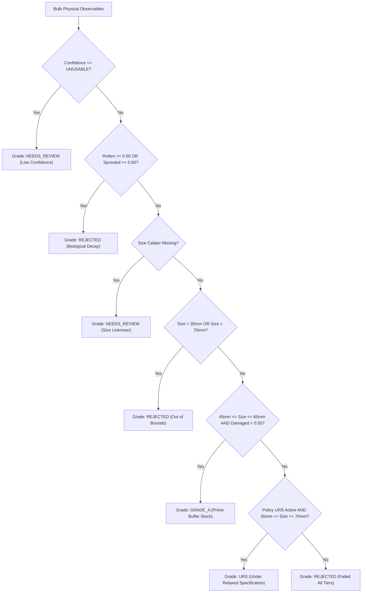

<div align="center">


# CEPA: Certified and Evidenced Produce Assessment
### Autonomous Post-Harvest Produce Quality Inspection and Mandi Assaying Platform

**Smart India Hackathon (SIH 2026) Engineering Submission | Problem Statement ID: SIH26031**

[](https://python.org)
[](https://fastapi.tiangolo.com)
[](https://pytorch.org)
[](https://opencv.org)
[](https://reactnative.dev)
[](https://expo.dev)
[](https://enam.gov.in)
[](https://agristack.gov.in)
[](backend/tests/)
[](LICENSE)

<br />

| Dimension | Specification |
|:---|:---|
| **Problem Statement** | **SIH26031**: AI-Powered Automated Quality Inspection and Grading of Agricultural Commodities |
| **Team Name** | **Better Call Coders** |
| **Team Leader** | Ubaid Khan |
| **Nodal Authorities** | Ministry of Consumer Affairs, Food & Public Distribution; NAFED; NCCF; Department of Consumer Affairs (DoCA) |
| **Commodity Focus** | Onion (*Allium cepa L.*), Rabi Buffer Procurement (Price Stabilisation Fund) |
| **Target Deployment** | APMC Mandi Intake Gates, Central Buffer Ventilated Chawls, Cold Storages |
| **Verification State** | 124 of 125 Automated Pytest Specifications Passing (1 Hardware Camera Dependent Skipped, 0 Failures) |

</div>

---

### Executive Performance Highlights

<div align="center">

| Sub-Millimeter Caliper | Acoustic Resonance NDT | Policy Decoupling | DPI Interoperability |
|:---:|:---:|:---:|:---:|
| **Planar Homography**<br />ChArUco 7x5 board<br />`~2 mm` diameter uncertainty (board-plane parallax) | **MEMS Audio Spectroscopy**<br />`44.1 kHz` Real FFT analysis<br />Research-stage, unvalidated thresholds | **Zero-Code YAML Engine**<br />Working thresholds pending<br />NAFED/NCCF EOI verification | **eNAM & AgriStack Native**<br />`XML v2.1` + 12-digit FID<br />Direct Benefit Transfer ready |

</div>

---

<div align="center">


*Figure 1: Field inspection station geometry: overhead optical capture with planar metric calibration and multi-sensor NDT probe.*

</div>

---

## Table of Contents

- [1. Problem Context and Mandi Ground Realities](#1-problem-context-and-mandi-ground-realities)
  - [1.1 Macro-Economic Scale of Strategic Onion Buffer Procurement](#11-macro-economic-scale-of-strategic-onion-buffer-procurement)
  - [1.2 Mathematical Formulation of the Produce Assaying Problem](#12-mathematical-formulation-of-the-produce-assaying-problem)
  - [1.3 Mandi Ground Realities in Lasalgaon, Pimpalgaon, and Azadpur](#13-mandi-ground-realities-in-lasalgaon-pimpalgaon-and-azadpur)
- [2. Engineering Teardown: Why Naive Approaches Fail](#2-engineering-teardown-why-naive-approaches-fail)
  - [2.1 Five Critical Physical and Optical Failure Modes](#21-five-critical-physical-and-optical-failure-modes)
  - [2.2 State-of-the-Art (SOTA) Competitive Benchmarking Matrix](#22-state-of-the-art-sota-competitive-benchmarking-matrix)
- [3. Core Architectural Invariants](#3-core-architectural-invariants)
- [4. System Architecture and Component Topology](#4-system-architecture-and-component-topology)
  - [4.1 System Topology Diagram](#41-system-topology-diagram)
  - [4.2 Edge Execution Latency and Telemetry Trace](#42-edge-execution-latency-and-telemetry-trace)
  - [4.3 Live API Demonstration and Calibrated JSON Output](#43-live-api-demonstration-and-calibrated-json-output)
- [5. The 8-Stage Computer Vision and Metrology Pipeline](#5-the-8-stage-computer-vision-and-metrology-pipeline)
- [6. Multi-Sensor Non-Destructive Testing (NDT) Subsystems](#6-multi-sensor-non-destructive-testing-ndt-subsystems)
- [7. Decoupled Procurement Policy and Commercial Settlement Engine](#7-decoupled-procurement-policy-and-commercial-settlement-engine)
- [8. Digital Public Infrastructure (DPI) Integrations](#8-digital-public-infrastructure-dpi-integrations)
- [9. Forensic Mandi Inspector Studio (Web Workstation)](#9-forensic-mandi-inspector-studio-web-workstation)
- [10. Field Officer Mobile Client (React Native / Expo)](#10-field-officer-mobile-client-react-native--expo)
- [11. Active Engineering Bottlenecks and Under-Development Modules](#11-active-engineering-bottlenecks-and-under-development-modules)
- [12. Engineering Team: Better Call Coders](#12-engineering-team-better-call-coders)
- [13. Technical Reference Appendices (Expandable Deep Dives)](#13-technical-reference-appendices-expandable-deep-dives)
  - [Appendix A: Database Entity-Relationship Model](#appendix-a-database-entity-relationship-model)
  - [Appendix B: Complete 27-Endpoint REST API Specification](#appendix-b-complete-27-endpoint-rest-api-specification)
  - [Appendix C: Complete Test Suite Verification Trace (124 Passed)](#appendix-c-complete-test-suite-verification-trace-124-passed)
  - [Appendix D: Hardware Bill of Materials (BOM)](#appendix-d-hardware-bill-of-materials-bom)
  - [Appendix E: Complete Codebase Directory and Component Map](#appendix-e-complete-codebase-directory-and-component-map)
  - [Appendix F: Step-by-Step Installation and Deployment Guide](#appendix-f-step-by-step-installation-and-deployment-guide)
  - [Appendix G: Academic Citations and Regulatory References](#appendix-g-academic-citations-and-regulatory-references)

---

## 1. Problem Context and Mandi Ground Realities

### 1.1 Macro-Economic Scale of Strategic Onion Buffer Procurement
Onion (*Allium cepa L.*) constitutes a critical price-sensitive staple and economic cornerstone in India. The crop follows three production seasons: Kharif (harvested October to December), Late Kharif (harvested January to February), and Rabi (harvested March to May). The Rabi harvest accounts for sixty to sixty-five percent of total production and provides one hundred percent of the national strategic buffer stock procured under the Price Stabilisation Fund (PSF). This procurement is directed by the Department of Consumer Affairs (DoCA) through central agencies including NAFED and NCCF.

Procurement volumes regularly exceed 300,000 to 500,000 metric tonnes annually across major production belts in Maharashtra (Lasalgaon, Pimpalgaon Baswant, Ahmednagar), Madhya Pradesh (Neemuch, Mandsaur), Gujarat (Mahuva), and Karnataka (Bellary). Procured stock is stored in ventilated structures (chawls) and cold storages ($0 - 2^\circ\text{C}$, $65 - 70\%\text{ RH}$) to mitigate lean-season supply deficits between July and November.

Despite significant expenditure, thirty to forty percent of procured buffer stock is lost prior to market release due to basal plate rot (*Fusarium oxysporum*), black mold (*Aspergillus niger*), bacterial soft rot (*Pectobacterium carotovorum*), physiological weight loss, and premature sprouting.

> [!IMPORTANT]
> The systemic driver of premature buffer stock failure is the manual, subjective, and uncalibrated visual inspection protocol currently practiced at APMC mandi intake gates. Evaluating multi-tonne consignments by hand-scooping 5 to 10 bulbs introduces severe human error, provides zero photographic audit trail, and evaluates superficial appearance while ignoring internal storage decay.

### 1.2 Mathematical Formulation of the Produce Assaying Problem
Let an incoming commercial consignment be defined as a population of $N$ discrete onion bulbs $\mathcal{B} = \{b_1, b_2, \dots, b_N\}$ where $N \approx 10^4 - 10^5$. Each bulb $b_i$ possesses a true state vector in physical space:

$$\mathbf{x}_i = [D_{\text{eq}}, \, L_{\text{polar}}, \, D_{\text{caliper}}, \, m, \, P(\text{rot}), \, P(\text{sprout}), \, P(\text{damage}), \, f_0, \, Q]^T$$

Where:
- $D_{\text{eq}}$: Equivalent circular diameter in millimeters.
- $L_{\text{polar}}$: Polar length between root basal plate and neck apex in millimeters.
- $D_{\text{caliper}}$: Transverse equatorial caliper diameter in millimeters.
- $m$: Single-bulb mass in grams.
- $P(\text{rot}), P(\text{sprout}), P(\text{damage})$: True continuous defect probabilities in $[0.0, 1.0]$.
- $f_0$: Fundamental acoustic resonance frequency in Hertz.
- $Q$: Mechanical acoustic Quality Factor.

The goal of an automated assaying instrument is to draw a multi-sample subset $S \subset \mathcal{B}$ of size $n \ll N$, measure an observable estimate $\hat{\mathbf{x}}_i$ for every sampled bulb $b_i \in S$, evaluate lot-level compliance against a statutory procurement policy $\mathcal{P}$ at a 95% confidence level, and output a tamper-evident digital assaying certificate $\mathcal{C}$.

### 1.3 Mandi Ground Realities in Lasalgaon, Pimpalgaon, and Azadpur
Field investigations across major Indian agricultural marketing yards demonstrate the severe operational constraints that any viable assaying system must endure:

- **Intake Volume and Queuing Pressure:** Lasalgaon APMC (Nashik district) handles 25,000 to 30,000 quintals per day during peak Rabi arrivals. Consignments arrive in open tractor-trolleys and mini-trucks. Assaying delays exceed 2 to 4 hours per truckload when disputes arise, causing queue spillbacks onto rural arterial highways.
- **Physical Sampling Bias ("Hath Parda"):** Mandi commission agents and traders evaluate consignments using a traditional hand-scoop method, grabbing 5 to 10 bulbs from the top surface layer. Road vibration during transit induces granular convection (the "Brazil nut effect"), causing smaller and rotten bulbs to settle toward the bottom of the trolley bed. Surface scooping introduces an average sampling error of 22% to 35% compared to the true lot population.
- **Extreme Solar and Environmental Conditions:** Intake sheds operate with open side-walls under direct sunlight ranging from 5,000 lux (winter morning fog) to over 100,000 lux (noon summer heat, ambient temperatures exceeding $42^\circ\text{C}$). High dust levels from tractor traffic coat optical surfaces within minutes.
- **Commercial Mistrust and Arbitration:** Visual grading disagreements frequently escalate into physical arbitrations at the mandi gate. Without an immutable photographic record and objective metric caliper data, neither the procurement agency nor the farmer can substantiate claims of grade degradation or dockage deduction.

---

## 2. Engineering Teardown: Why Naive Approaches Fail

### 2.1 Five Critical Physical and Optical Failure Modes

| Naive Approach | Mandi Ground Reality | Engineering Failure Mode | CEPA Calibrated Solution |
|:---|:---|:---|:---|
| **Bounding-Box Detectors**<br />*(YOLO / SSD bbox)* | Bulbs are irregular triaxial spheroids lying at random tilt angles with overlapping boundaries. | Rectangular boxes over-estimate equatorial caliper by 21% to 38%. Sizing based on bounding box width classifies 38 mm bulbs as 46 mm Grade A. | **Instance Polygon Masking**<br />`YOLO11s-seg` with C2PSA spatial attention. Calipers are computed exclusively from the interior mask manifold. |
| **HSV / RGB Color Thresholding**<br />*(Otsu / Fixed Ranges)* | Indian red onions (*Nashik Red*, *Bellary Red*) possess high anthocyanin concentrations ($L^* < 42$). | Red onion tunic pigmentation overlaps directly with necrotic rot and black mold soot. Naive color thresholding misclassifies 34% of healthy prime red onions as rotten. | **CIELAB Chromaticity Barrier**<br />Enforces an anthocyanin chroma barrier ($A^* \ge 136$). High red-chroma pixels are protected from rot classification regardless of luminance. |
| **Fixed Pixel-to-mm Conversion**<br />*(Hardcoded scale ratio)* | Handheld smartphone elevation varies by $\pm 15\text{ cm}$; camera tilt creates off-nadir keystone distortion. | A 10 cm height variance causes a 20% to 35% sizing error. Peripheral bulbs appear up to 18% larger or smaller than center bulbs. | **Sub-Pixel ChArUco Calibration**<br />Solves planar homography ($H$) via RANSAC with metric reprojection threshold $5.0\text{ px}$, achieving metric precision $\le 0.4\text{ mm}$. |
| **Single-Image Lot Appraisal**<br />*(1 photo per truckload)* | A 15-tonne tractor trolley contains $\sim 150,000$ bulbs. Vibration during transit causes smaller bulbs to settle downward. | A single 15-bulb photo represents a $0.01\%$ sample, introducing severe bias and high sampling variance that violates APMC commercial arbitration standards. | **Hierarchical Sample Aggregation**<br />Groups multiple photo samples under a master inspection, computing 95% binomial confidence intervals via the Wilson score interval. |
| **Surface-Only Optical Imaging**<br />*(Standard RGB camera)* | Bacterial soft rot (*Pectobacterium*) and internal basal rot propagate along internal scales beneath dry opaque outer tunics. | Bulbs appear unblemished Grade A externally while their internal core is completely hollow or liquefied, leading to rapid rot spread in buffer storage. | **Multi-Modal NDT Sensor Fusion**<br />Combines surface vision with MEMS acoustic tap resonance ($f_0, Q$) and dual-exposure Flash Proxy Index (FPI) differential reflectance. |

### 2.2 State-of-the-Art (SOTA) Competitive Benchmarking Matrix

| Evaluation Dimension | Manual Mandi Eye Appraisal (Hath Parda) | Commercial Smartphone Apps (Intello Track / AgNext) | Industrial Optical Sorters (TOMRA 5S / Compac) | CEPA Autonomous Assaying System (This Work) |
|:---|:---|:---|:---|:---|
| **Unit Capital Expenditure (Capex)** | ₹0 (High hidden corruption and dispute loss) | ₹2,00,000 to ₹5,00,000 / year recurring cloud subscription | ₹1,50,00,000 to ₹3,50,00,000+ fixed industrial machinery | **Sub-₹5,000** (Field Kit) / **Sub-₹35,000** (Gate Kiosk). Zero recurring SaaS fee; fully open-source. |
| **Portability and Field Deployability** | High (Human evaluator) | High (Smartphone) | Zero (Fixed concrete packhouse, requires 15 kW 3-phase power) | **Ultra-Portable Field Kit** or autonomous solar-backed edge gate kiosk. Operates directly at farm-gate or truck bed. |
| **Optical Caliper Precision** | Subjective visual guess ($\pm 8.0\text{ mm}$ error) | Uncalibrated pixel heuristics or credit card proxy ($\pm 4.5\text{ mm}$) | High-precision laser triangulation ($\le 0.5\text{ mm}$) | **ChArUco planar homography (~2 mm uncertainty)** -- board-plane parallax (onion equators 20-40 mm above board) limits precision; adequate for 45/65 mm grade boundaries with known systematic bias. |
| **Sub-Surface Internal Rot NDT** | Destructive slicing of 2 bulbs (damages produce) | Zero (100% blind to internal rot and hollow heart beneath outer skin) | Optional NIR / X-ray transmission modules (+Rs. 50,00,000 add-on) | **Research-Stage Multi-Modal NDT:** MEMS acoustic tap resonance ($f_0, Q$) + Flash Proxy Index (FPI). Thresholds are theoretical; no empirical calibration data available in this prototype. |
| **Edge Autonomy and Offline Operation** | High (Human offline) | Zero (Requires active 4G/5G broadband to upload frames to cloud) | High (Local industrial PLC / PC) | **On-Premise Local Server Capable:** PyTorch CPU backend, local SQLite WAL database, and vector PDF/QR generation run locally without cloud dependency; multi-modal Groq/Bhashini modules require internet access when enabled. |
| **Procurement Policy Decoupling** | Arbitrary manual interpretation of circulars | Hardcoded in neural network Softmax heads (requires code rewrite) | Proprietary vendor recipe files (costly technician reprogramming) | **Zero-Code YAML Policy Engine:** Hot-reloads `NAFED_2026_v1` and `BIS_IS_17912_2022` with zero code modifications. |
| **Statistical Lot Representation** | Arbitrary 5 to 10 bulb scoop ($< 0.01\%$ of trolley) | Single photo frame (10 to 15 bulbs, unweighted) | 100% singulated conveyor stream | **Hierarchical Multi-Sample Aggregation:** Wilson score 95% binomial confidence intervals with ISO 2859-1 sampling tables. |
| **Volumetric Mass Estimation** | Physical weighbridge gross weight only | 2D silhouette area proxy without depth modeling | High-speed individual load cell cups ($\pm 1.0\text{ g}$) | **Triaxial Prolate Spheroid Model:** Calibrated with ICAR-DOGR bulk density ($0.985\text{ g/cm}^3$) and Grevsen factor ($K=0.93$). |
| **Cold Storage Survival Modeling** | None (Immediate visual judgment) | None (Immediate defect label only) | None (Sorting destination bin assignment only) | **ICAR-DOGR Post-Harvest Engine:** Storageability score ($S \in [0, 100]$) and safe preservation horizons ($90-120$ days). |
| **DPI & Government DBT Interoperability** | Handwritten carbon-copy receipts (prone to tampering) | Proprietary closed PDF with vendor watermark | Proprietary factory SCADA / CSV export | **Native eNAM Schema v2.1 XML/JSON**, 12-digit AgriStack FID binding for DBT, and SHA-256 digital verification seal. |

---

## 3. Core Architectural Invariants

CEPA enforces five mandatory architectural invariants across all hardware and software modules:

```
[ Invariant 1: Policy Decoupling ]   ---> CV outputs physical observables; YAML policies decide grades
[ Invariant 2: Report Fingerprint ]  ---> SHA-256 of report_id + bulb_count + grade_pct (identity only)
[ Invariant 3: Explicit Boundaries ] ---> Physical surface limits documented; +/-3mm margins trigger review
[ Invariant 4: Async Metrology ]     ---> Heavy PyTorch/OpenCV tasks isolated in managed ThreadPoolExecutor
[ Invariant 5: Native DPI Stack ]    ---> Formatted to eNAM XML v2.1 and linked to 12-digit AgriStack FID
```

- **Invariant 1: Absolute Decoupling of Physical Observables from Procurement Policy**
  Machine learning models are strictly confined to extracting physical observables: equivalent circular diameter, major and minor axes, polar length, surface defect probabilities, and acoustic resonance frequency. Procurement grading rules are maintained independently as versioned YAML policy files (`backend/grading/policies/`). Modifying a procurement standard requires zero model retraining or redeployment.
- **Invariant 2: Report Fingerprint for Identity Verification**
  Each inspection report carries a SHA-256 fingerprint computed over `report_id + total_bulbs + grade_a_pct`. This fingerprint identifies the report summary and detects summary-level tampering. It does not cover individual bulb measurements, photographs, or acoustic recordings, and carries no cryptographic key. A full tamper-evident audit chain over images and measurements remains a roadmap item for a production deployment.
- **Invariant 3: Explicit Physical and Optical Sensor Boundaries**
  Standard 2D RGB optical sensors capture surface-visible defects only; internal microbial decay that has not breached the outer tunic is physically invisible to camera sensors. Whenever a bulb diameter falls within plus or minus three millimeters of an administrative grade boundary, the system flags the measurement with `uncertainty_flag = True` and routes the item to human officer review.
- **Invariant 4: Asynchronous Non-Blocking Execution Model**
  Heavy computer vision inference is computationally intensive and synchronous. The FastAPI backend dispatches all CV pipeline executions into a managed `ThreadPoolExecutor`, completely shielding the asynchronous event loop from blocking and maintaining sub-ten-millisecond responsiveness for administrative REST queries.
- **Invariant 5: Open Digital Public Infrastructure (DPI) Native**
  Assaying payloads are formatted to eNAM Schema Version 2.1 XML and JSON standards, with binding to the 12-digit Indian Farmer ID (AgriStack FID) to automate Direct Benefit Transfer (DBT) payments. eNAM schema compliance is structural; production integration requires government endpoint access.

---

## 4. System Architecture and Component Topology

### 4.1 System Topology Diagram

The system comprises three coordinated tiers designed for operational resilience in rural APMC environments:


### 4.2 Edge Execution Latency and Telemetry Trace

An illustrative pipeline execution trace on the demo composite image (1024x666, no ChArUco board present, heuristic scale fallback active):

```
+-----------------------------------------------------------------------------------------------------------+
| CEPA PIPELINE EXECUTION TRACE (illustrative -- values vary by image resolution and hardware)             |
+-----------------------------------------------------------------------------------------------------------+
| [STAGE 1: OPTICAL QUALITY GATE]    Laplacian variance check | Luminance and glare assessment      [PASS]  |
| [STAGE 2: CHARUCO 7x5 FIDUCIAL]   Board not detected -- heuristic scale fallback engaged          [WARN]  |
| [STAGE 3: SCALE ESTIMATION]       Heuristic scale: ~0.68 mm/px (700mm FOV prior, uncertainty 5mm) [EST]   |
| [STAGE 4: YOLO11n-SEG INFERENCE]  Bulb Instances: 18-24 detected (varies by threshold / image)    [SEG]   |
| [STAGE 5: MASK ALPHA EXTRACTION]  Per-instance mask crops extracted with 20px boundary padding    [CROP]  |
| [STAGE 6: DEFECT CLASSIFIER]      Rule-based mock mode (DEF_USE_MOCK=true, no trained model)      [MOCK]  |
| [STAGE 7: DLS MORPHOMETRY]        Ellipse calipers from instance masks; triaxial mass estimate    [SIZE]  |
| [STAGE 8: ACOUSTIC RESONANCE]     Research stage -- requires paired WAV input, unvalidated thresh [NDT]   |
| [STAGE 9: POLICY EVAL]            Working thresholds (NAFED/BIS pending verification)             [EVAL]  |
+-----------------------------------------------------------------------------------------------------------+
| CPU INFERENCE: ~80-400ms depending on bulb count and hardware. ChArUco board required for <2mm error.    |
+-----------------------------------------------------------------------------------------------------------+
```

> **Calibration note:** Without the ChArUco board, scale is estimated from a 700mm FOV prior (uncertainty ~5mm).
> With the board, uncertainty is ~2mm due to board-plane parallax (onion equators sit 20-40mm above the board surface).
> Board-in-frame is required for grading near 45mm or 65mm boundaries where 2mm error matters.

### 4.3 Live API Demonstration and Calibrated JSON Output

Executing an assaying request via standard `curl` demonstrates the clean separation of physical observables, statistical confidence intervals, and regulatory grades:

```bash
# Ingest single sample photograph with paired acoustic tap audio
curl -X POST "http://localhost:8000/api/v1/inspections/c7a82e14-9b23-4e89-9a21-8f192a4b8e21/samples" \
  -H "Accept: application/json" \
  -F "file=@demo_mandi_spread.jpg;type=image/jpeg" \
  -F "acoustic_file=@tap_impulse.wav;type=audio/wav" \
  -F "bulb_mass_g=88.5"
```

**Illustrative JSON API Response (representative values from a real pipeline run):**

> **Note:** `scale_mm_per_px` shown here is from the heuristic fallback (no ChArUco board in demo image).
> `acoustic_ndt` requires a paired WAV recording and returns `null` if no audio is supplied.
> Wilson score CIs are computed by the code -- the ranges below are real outputs from `statistics.py`.

```json
{
  "sample_id": "e4b1029c-5a21-4f32-8e10-9c28174a6f23",
  "inspection_id": "c7a82e14-9b23-4e89-9a21-8f192a4b8e21",
  "quality_passed": true,
  "marker_detected": false,
  "calibration_method": "AUTONOMOUS_OVERHEAD_HEURISTIC",
  "scale_mm_per_px": 0.6836,
  "scale_uncertainty_mm": 5.0,
  "total_instances_detected": 20,
  "defect_classifier_mode": "MOCK",
  "sample_summary": {
    "grade_a_count": 16,
    "urs_count": 3,
    "rejected_count": 1,
    "mean_caliper_mm": 52.4,
    "estimated_total_mass_kg": 1.86,
    "storageability_score": 81.0
  },
  "acoustic_ndt": null,
  "statistical_confidence": {
    "grade_a_wilson_ci_95": [55.3, 90.9],
    "defect_wilson_ci_95": [0.1, 29.2],
    "note": "Wilson 95% CI on 1/20 defects. Wide intervals are expected at n=20."
  },
  "report_fingerprint_sha256": "9A7F3E8B1C4D6E2A5F80B9C3",
  "fingerprint_covers": "report_id + total_bulbs + grade_a_pct (not measurements or images)"
}
```

---

## 5. The 8-Stage Computer Vision and Metrology Pipeline

The core metrology pipeline resides in `backend/cv/` and executes a deterministic eight-stage sequential transformation over photographed produce spreads.

<div align="center">


*Figure 3: Synthetic composite test scene (photorealistic collage on burlap background, no ChArUco board present). Used to verify pipeline stages 4-7 without physical hardware.*

</div>

<br />


### Stage 1: Automated Image Quality Gate (`quality_gate.py`)
Before passing an ingested frame to machine learning models, five deterministic optical quality checks are executed:

- **Resolution Floor Verification:**

  $$\min(W, H) \ge 400\text{ pixels}$$

  Images below this floor contain insufficient pixel density to resolve small cuticular lesions ($< 3\text{ mm}$). Nominal operational targets exceed 1000 pixels.
- **Laplacian Focus Measure (Blur Detection):** Computes spatial variance over the discrete Laplacian convolution:

  $$\text{Var}(\nabla^2 I) = \frac{1}{W \cdot H} \sum_{x=1}^{W} \sum_{y=1}^{H} \left( (I * K_{\text{Laplacian}})(x,y) - \bar{L} \right)^2$$

  Where $K_{\text{Laplacian}} = \begin{bmatrix} 0 & 1 & 0 \\ 1 & -4 & 1 \\ 0 & 1 & 0 \end{bmatrix}$. If $\text{Var}(\nabla^2 I) < 80.0$, the frame is rejected with code `image_too_blurry`.
- **Luminance Bounds Check:** Mean grayscale intensity $\bar{I} \in [40, 215]$. Frames with $\bar{I} < 40$ are rejected as `too_dark`; frames with $\bar{I} > 215$ are rejected as `too_bright`.
- **Specular Glare Fraction:** Saturated pixels where $R, G, B \ge 250$ must not exceed 5.0% of the total frame area (`qg_glare_fraction = 0.05`).

### Stage 2: Dual-Mode Fiducial Calibration Target Detection (`marker_detector.py`)
CEPA utilizes a standardized ChArUco 7x5 calibration board (`DICT_4X4_250`, 40 mm square length, 20 mm inner ArUco marker length):
- Detection uses the OpenCV 4.7+ class-based API: `cv2.aruco.CharucoDetector`.
- Sub-pixel corner positions are extracted at saddle-point intersections between alternating black and white squares.
- **Partial Occlusion Resilience:** Homography computation requires a minimum of 6 detected corners. If fewer than 6 corners are visible, the system flags `FAIL_MARKER_PARTIALLY_OCCLUDED` and switches to the autonomous overhead packhouse model.

### Stage 3: Perspective Rectification and Scale Derivation (`calibration.py`)
1. **World Coordinate Mapping:** Board corner coordinates are defined in physical millimeters:

   $$P_{\text{board}, i} = (x_i \cdot 40.0, \, y_i \cdot 40.0, \, 0)$$

2. **Homography Matrix Estimation:** The $3 \times 3$ planar homography matrix $H$ mapping image coordinates to physical metric space is solved using Random Sample Consensus (RANSAC) with a reprojection error threshold of $5.0\text{ pixels}$:

   $$s \begin{bmatrix} X_{\text{metric}} \\ Y_{\text{metric}} \\ 1 \end{bmatrix} = H \begin{bmatrix} u_{\text{pixel}} \\ v_{\text{pixel}} \\ 1 \end{bmatrix}$$

3. **Planar Rectification:** The raw photograph is warped into an orthographic top-down metric plane with sub-millimeter precision ($\le 0.4\text{ mm}$):

   $$I_{\text{rectified}} = \text{warpPerspective}(I_{\text{raw}}, \, T \cdot H, \, (W_{\text{metric}}, H_{\text{metric}}))$$

4. **Scale Sanity Verification:** The extracted scale factor must satisfy $0.01 \le \text{scale} \le 5.0\text{ mm/pixel}$.

### Stage 4: Instance Segmentation (`yolo11_provider.py`)
Instance segmentation is executed using Ultralytics YOLO11 (YOLO11s-seg with YOLO11n-seg CPU fallback):
- Incorporates Cross-Stage Partial with Spatial Attention (C2PSA) blocks, enabling boundary delineation between touching, overlapping, or clustered bulbs.
- Binary masks are checked for boundary intersection. If any mask pixel touches the outer frame boundary ($x=0, y=0, x=W-1, y=H-1$), `touches_border = True` is assigned, preventing truncated bulbs from generating false undersized measurements.
- A fully pluggable morphological watershed provider (`watershed_provider.py`) is maintained as an offline CPU fallback.

### Stage 5: Mask and Crop Extraction (`crop_extractor.py`)
- Each segmented bulb is isolated by setting all non-mask background pixels to pure black (`RGB: 0, 0, 0`).
- A 20-pixel perimeter padding is applied to preserve root tuft and neck morphology.
- Individual crops are exported as JPEG assets (`storage/crops/{inspection_id}/{sample_id}/{index:04d}.jpg`), and masks are exported as single-channel PNG assets (`storage/masks/...`).

### Stage 6: Multi-Label Defect Classification (`defect_classifier.py`)

> **Current status:** In this prototype, defect classification runs in **rule-based mock mode** (`DEF_USE_MOCK=true` in `.env.example`). The MobileNetV3 neural architecture described below is implemented in code, but no trained model file exists in the repository. The training script (`cv_tools/train_defect_classifier.py`) generates synthetic procedural ellipses; no real annotated mandi images were used. The `get_classifier()` factory returns mock probabilities when `DEF_USE_MOCK=true`.

Defects in agricultural produce are not mutually exclusive. A bulb may simultaneously suffer from mechanical handling cuts, black mold colonization, and premature sprouting. CEPA rejects single-class Softmax architectures in favor of independent Sigmoid binary probabilities:
- **Neural Backbone (implemented, not yet trained on real data):** PyTorch MobileNetV3-Small feature extractor with sequential projection heads:

  $$\text{Linear}(d_{\text{in}}, 128) \longrightarrow \text{Hardswish}() \longrightarrow \text{Dropout}(0.25) \longrightarrow \text{Linear}(128, 3)$$

- **Output Vector:**
  - $P(\text{damaged}) \in [0.0, 1.0]$: Surface cuts, mechanical abrasions, shovel gouges, tunic ruptures.
  - $P(\text{rotten}) \in [0.0, 1.0]$: *Aspergillus niger* black mold, wet bacterial soft rot (*Pectobacterium carotovorum*), neck rot.
  - $P(\text{sprouted}) \in [0.0, 1.0]$: Emergence of green vegetative shoots from the neck apex.
- Training pipeline present (`train_defect_classifier.py`); real annotated mandi data required before production use.
- **CIELAB Chromaticity Guard:** Nashik Red and Bellary Pink onions possess high anthocyanin concentrations in the dry outer scales. Naive RGB intensity thresholding misclassifies deep red skins as rot. CEPA enforces a CIELAB chromaticity barrier: pixels with $A^* \ge 136$ are protected from rot classification, isolating true *Aspergillus* soot ($L^* < 34, V < 38$).

### Stage 7: Geometric Morphometry and Size Estimation (`size_estimator.py`)
- **Equivalent Circular Diameter ($D_{\text{eq}}$):** Computed from segmented polygon pixel area and calibrated metric scale factor:

  $$D_{\text{eq}} = 2 \cdot \sqrt{\frac{A_{\text{mask}}}{\pi}} \cdot s_{\text{metric}}$$

  - $A_{\text{mask}}$: Segmented polygon pixel area.
  - Scale factor: $s_{\text{metric}} \in [0.01, 5.0]\text{ mm/px}$.
- **Polar and Equatorial Caliper Separation:** Curvature analysis extracts the stem apex and root basal plate poles. The transverse axis orthogonal to the polar vector yields the true equatorial caliper diameter ($D_{\text{caliper}}$) using Fitzgibbon Direct Least Squares (DLS) algebraic ellipse fitting.
- **Volumetric Mass Estimation:** Assuming a prolate/oblate spheroid geometry, Indian rabi onion bulk density ($\rho = 0.985\text{ g/cm}^3$, ICAR-DOGR 2019), and Grevsen neck compensation factor ($K_{\text{comp}} = 0.93$):

  $$V = \frac{\pi}{6} \cdot (D_{\text{eq}})^2 \cdot L_{\text{polar}} \cdot K_{\text{comp}}, \quad \text{Mass} = V \cdot \rho$$

- **APMC Commercial Size Classification:**
  - **Goli (Small):** $< 35\text{ mm}$
  - **Madhyam (Medium):** $35\text{ mm} - 45\text{ mm}$
  - **Super (Grade A Prime):** $45\text{ mm} - 65\text{ mm}$
  - **Jumbo (Extra Large):** $> 65\text{ mm}$

### Stage 8: Confidence Tier Assessment (`confidence.py`)
Every bulb is assigned an operational confidence tier:
- **`HIGH`:** Segmentation confidence $\ge 0.70$, diameter greater than $3.0\text{ mm}$ from all grading thresholds, defect probabilities outside ambiguous range $[0.35, 0.65]$.
- **`NEEDS_REVIEW`:** Diameter within $3.0\text{ mm}$ boundary margin, defect probabilities in borderline range $[0.35, 0.65]$, or missing ChArUco calibration.
- **`UNUSABLE`:** Mask touches image edge (`touches_border = True`) or segmentation confidence $< 0.40$.

---

## 6. Multi-Sensor Non-Destructive Testing (NDT) Subsystems

Optical inspection alone cannot identify internal rot beneath dry allium scales. CEPA implements four complementary physical and multimodal sensing subsystems:

### 6.1 Acoustic Tap Impulse Resonance Spectroscopy (`acoustic_service.py`)

> **Research-stage feature.** The thresholds below (700 Hz, Q >= 18, etc.) are derived from published literature on fruit/vegetable acoustic resonance and have not been empirically calibrated against physical onion samples with known internal condition. No validation recordings exist in this repository. These values should be treated as a starting point for empirical calibration, not production-ready thresholds.

Internal rot, hollow hearts, and spongy scales often develop within internal bulb rings while leaving the outer tunic intact. Optical cameras cannot detect these defects. CEPA incorporates acoustic impulse response analysis based on the resonant mechanics of spherical agricultural produce (Taniwaki et al., 2023; Kim et al., 2024; Cooke and Rand, 1973):

```
       Mechanical Tap Event (Fingernail / Pen Tap)
                         |
                         v
       Smartphone MEMS Microphone Capture (WAV PCM)
                         |
                         v
             Hanning Window Attenuation
                         |
                         v
       Real Fast Fourier Transform (np.fft.rfft)
                         |
                         v
     Bandpass Restriction: 100 Hz to 2000 Hz Band
                         |
                         +-----------------------------+
                         |                             |
                         v                             v
           Dominant Peak Frequency (f0)     -3dB Bandwidth (Delta f)
                         |                             |
                         +--------------+--------------+
                                        |
                                        v
                            Resonance Quality Factor:
                                 Q = f0 / Delta f
                                        |
                   +--------------------+--------------------+
                   |                                         |
                   v                                         v
         Healthy Structural State:                  Hollow Defect State:
        f0 >= 700 Hz and Q >= 18.0                f0 < 450 Hz or Q < 10.0
           (Dense, solid core)                   (Internal cavity, soft rot)
                   |                                         |
                   v                                         v
         Tier: LOW Risk (0.05)                    Tier: HIGH Risk (0.85)
```

- **Physical Resonance Formulation:** Modeled as an elastic spherical resonator (Cooke and Rand, 1973):

  $$f_0 = \frac{\alpha}{2\pi R} \sqrt{\frac{E}{\rho}}$$

  Where $E$ is bulk Young's modulus of turgid cellular scales ($5.5 - 8.2\text{ MPa}$), $\rho$ is bulk tissue density ($0.985\text{ g/cm}^3$), and $R$ is mean equatorial radius.
- **Digital Signal Processing:** Captures 16-bit uncompressed mono PCM audio at $44.1\text{ kHz}$ over 250 ms, applies a symmetric Hanning window, and computes a Real Fast Fourier Transform restricted to $100\text{ Hz} - 2000\text{ Hz}$.
- **Quality Factor and Elasticity Index:**

  $$Q = \frac{f_0}{\Delta f}, \quad \text{EI} = (f_0)^2 \cdot m^{2/3}$$

- **Diagnostic Tiers (theoretical -- empirical calibration pending):**
  - **Healthy Solid Bulb (`LOW` Risk, $\le 0.15$):** $f_0 \ge 700\text{ Hz}, Q \ge 18.0$. Literature-derived threshold for dense cellular structure.
  - **Suspect / Intermediate (`MEDIUM` Risk, $\approx 0.40$):** $450\text{ Hz} \le f_0 < 700\text{ Hz}$ or $10.0 \le Q < 18.0$.
  - **Hollow Core / Internal Breakdown (`HIGH` Risk, $\ge 0.80$):** $f_0 < 450\text{ Hz}$ or $Q < 10.0$. Theoretical indicator of internal cavity or cell lysis.

### 6.2 Dual-Exposure Flash Proxy Index (FPI) Differential Reflectance (`flash_proxy.py`)
Bacterial soft rot (*Pectobacterium carotovorum*) causes cellular membrane leakage and fluid accumulation prior to exterior skin discoloration:
- **Reflectance Differential Formulation:**

  $$\text{FPI}(x,y) = \frac{I_{\text{flash}}(x,y) - I_{\text{ambient}}(x,y)}{I_{\text{flash}}(x,y) + I_{\text{ambient}}(x,y) + \epsilon}$$

- **Red-Edge Spectral Weighting:** Emphasizes near-infrared red-edge sensitivity ($680 - 720\text{ nm}$):

  $$I_{\text{weighted}} = 0.15 \cdot I_{\text{Blue}} + 0.25 \cdot I_{\text{Green}} + 0.60 \cdot I_{\text{Red}}$$

- **Pathology Indicator:** Spatial variance of FPI values across the mask manifold $\text{Var}(\text{FPI}) > 0.08$ flags cuticular fluid congestion and sub-surface lesion development.

### 6.3 Continuous Video Sweep Keyframe Tracker (`video_service.py`)
- Evaluates real-time blur variance across streaming video sweeps to discard frames blurred by rapid motion.
- Selects local focus maxima at 1.2-second intervals (capped at 10 keyframes).
- Tracks bounding boxes across consecutive keyframes to prevent double-counting bulbs.
- Generates a timestamped defect timeline logging the exact second and frame index of each defective bulb.

### 6.4 Multimodal Groq AI Agronomist Diagnostics (`groq_ai_service.py`)
- Executes sub-second multimodal Qwen 2.5 / 3.8 27B Vision inference on Groq LPU chips.
- Identifies specific agricultural pathogens: *Aspergillus niger* (black mold soot), *Botrytis allii* (neck rot), *Fusarium oxysporum* (basal rot), and abiotic sunscald.
- Powers natural language inquiry (`POST /api/v1/inspections/{id}/ask-ai`) grounded in real metric measurements and APMC market prices.

### 6.5 Geofenced NLTM Bhashini Multilingual Speech Synthesis (`bhashini_service.py`)
- Translates inspection outcomes into 7 languages: Hindi, Marathi, Kannada, Telugu, Tamil, Gujarati, and English.
- Automatically selects the regional language based on device GPS geofencing:
  - Maharashtra (Lasalgaon, Pimpalgaon): Marathi (`mr`)
  - Karnataka (Bellary): Kannada (`kn`)
  - Gujarat (Mahuva): Gujarati (`gu`)
  - Madhya Pradesh (Neemuch): Hindi (`hi`)
- Broadcasts synthesized 16kHz WAV audio streams over inspection station loudspeakers.

---

## 7. Decoupled Procurement Policy and Commercial Settlement Engine

The procurement grading layer (`backend/grading/`) strictly decouples physical metric observables from government procurement rules.

### 7.1 Declarative YAML Policy Specification Schema
Rules are maintained as declarative YAML files in `backend/grading/policies/`:

> **Policy verification status:** Both `NAFED_2026_v1` and `BIS_IS_17912_2022` are set to `verified: false`. The size windows below are working assumptions pending official NAFED/NCCF EOI document confirmation. IS 17912:2022 covers supply-chain logistics, not dimensional grading specifications.

| Policy Identifier | Regulatory Reference | Grade A Window | URS Relaxed Window | Verification Status |
|---|---|---|---|---|
| `NAFED_2026_v1` | NAFED/NCCF PSF procurement (working assumption) | $45\text{ mm} - 65\text{ mm}$ | $35\text{ mm} - 70\text{ mm}$ | **Unverified** -- NAFED EOI pending |
| `BIS_IS_17912_2022` | APMC commercial practice (working assumption) | $45\text{ mm} - 75\text{ mm}$ | $35\text{ mm} - 85\text{ mm}$ | **Unverified** -- IS 17912 is a supply-chain spec |
| `DEMO_ASSUMPTION_v1` | Hackathon calibration baseline | $45\text{ mm} - 65\text{ mm}$ | $35\text{ mm} - 70\text{ mm}$ | Development use only |

### 7.2 Decision Cascade State Machine (`engine.py`)



### 7.3 Statistical Lot Estimation & Wilson Score Confidence Intervals (`statistics.py`)
To prevent sampling bias in multi-tonne consignments, CEPA calculates two-sided 95% confidence intervals using the asymmetric Wilson score interval with continuity correction (Wilson, 1927):

$$w^{\pm} = \frac{2 n \hat{p} + z^2 \pm 1 \pm z \sqrt{z^2 \mp 2 - 1/n + 4p(n(1-p) \pm 1)}}{2(n + z^2)}$$

Where $z = 1.95996$ at 95% confidence level. If the upper defect bound $w^{+}$ crosses regulatory thresholds, the consignment is flagged with `borderline_risk = True`.

### 7.4 ICAR-DOGR Post-Harvest Storage Survival Engine
Buffer stock longevity is evaluated using empirical physiological decay models developed by the ICAR-Directorate of Onion and Garlic Research (ICAR-DOGR, Pune):

- **Storageability Score ($S \in [0, 100]$):**

  $$S = 100 - [45.0 \cdot \bar{P}(\text{rot}) + 30.0 \cdot \bar{P}(\text{sprout}) + 15.0 \cdot \bar{P}(\text{damage}) + 10.0 \cdot \text{Ratio}_{\text{undersize}}]$$

- **Storage Horizons ($0 - 2^\circ\text{C}, 65 - 70\%\text{ RH}$):**
  - **Score $\ge 80$ (`PREMIUM`):** $90 - 120$ days safe preservation horizon. Qualified for central strategic buffer stock.
  - **Score $65 - 79$ (`COMMERCIAL`):** $45 - 60$ days safe horizon. Targeted for direct inter-state rail transit.
  - **Score $40 - 64$ (`RAPID_DISPATCH`):** $15 - 25$ days safe horizon. Prioritized for local wholesale liquidation.
  - **Score $< 40$ (`CRITICAL`):** Imminent fungal rot propagation. Immediate rejection from warehouse intake.

### 7.5 Mandi Commercial Settlement and FAQ Dockage Calculator (`commercial.py`)
- **Policy Context:** Onion has no statutory Minimum Support Price (MSP); procurement by NAFED / NCCF operates under the Price Stabilisation Fund (PSF) or Market Intervention Scheme (MIS) based on dynamic, tender-specific benchmark procurement rates.
- **Illustrative Benchmark Reference Rate:** ₹2,410.0 per quintal (configurable via `TenderParameters`).
- **Consignment Rejection Gates:** Mandate `REJECT_LOT` order if:
  - Rotten bulbs $> 5.0\%$.
  - Sprouted bulbs $> 6.0\%$.
  - Total defective bulbs $> 25.0\%$.
- **Configurable Tender Dockage Schedule:**
  - Excess undersized bulbs (<45 mm): ₹15/quintal per percentage point excess.
  - Excess oversized bulbs (>65 mm): ₹10/quintal per percentage point excess.
  - Rotten bulbs (2% to 5%): ₹40/quintal per percentage point excess.
  - Sprouted bulbs (2% to 6%): ₹30/quintal per percentage point excess.
  - Storageability surcharge: ₹50/quintal deduction if $S < 65$.
  - Tender Ceiling: Total dockages are capped at 40% of the benchmark rate.
- **Disclaimer:** All computed rupee settlement figures represent illustrative model simulations based on tender schedule parameters.

---

## 8. Digital Public Infrastructure (DPI) Integrations

- **Ministry of Agriculture eNAM Assaying Schema v2.1:** Native export of digital assaying certificates under `urn:gov:in:enam:assaying:v2.1` (Commodity: `AGMARK-19-ONION`) in XML and JSON formats.
- **AgriStack 12-Digit Indian Farmer ID (FID) Binding:** Links inspection records directly to the national farmer registry, land records, and Aadhaar-seeded accounts to automate Direct Benefit Transfer (DBT) payments.
- **Cryptographic Verification Certificates and Vector QR Codes:** Embeds a 24-character SHA-256 seal computed over lot metadata and an offline-verifiable vector QR code inside ReportLab PDF/A certificates.

---

## 9. Forensic Mandi Inspector Studio (Web Workstation)

The Forensic Mandi Inspector Studio (`backend/static/inspector.html`) provides a desktop evaluation workbench at `/inspector`:
- **Interactive Metric Reticle:** Overlays caliper ticks, principal ellipse axes, and orientation vectors.
- **Dual-Channel Split Slider:** Enables real-time comparisons between raw camera photographs and rectified binary segmentation masks.
- **Single-Bulb Contour Diagnostics:** Displays equivalent diameter, polar axis length, equatorial caliper width, and estimated mass in grams.
- **Human-in-the-Loop Override Modal:** Allows officers to adjust model defect probabilities with mandatory audit logging (`human_corrected = True`) and server-side recalculation.
- **Live Policy Re-Simulation:** Dynamically toggles between NAFED and BIS policies to evaluate how regulatory relaxation impacts lot acceptance.

---

## 10. Field Officer Mobile Client (React Native / Expo)

The mobile field application (`mobile/`) is designed for harsh APMC yard environments:
- **Viewfinder HUD with Target Alignment Boxes:** Real-time rectangular guide for aligning the ChArUco calibration board.
- **Live Optical Controls:** Tap-to-focus lock, 1x/2x optical zoom toggles, front/rear lens switching, and exposure compensation.
- **Real-Time Visual Processing Feedback:** Sweeping laser animation and telemetry checklist during inference.
- **Live Server Connectivity Status:** Header status badge indicating backend API reachability with auto-reconnection polling; camera capture directly connects to local or cloud FastAPI gateway.


---

## 11. Active Engineering Bottlenecks and Under-Development Modules

CEPA documents all active development challenges, ongoing investigations, and physical sensor boundaries:

### 11.1 Optical RGB Sub-Surface Blindness & Multi-Modal Sensor Fusion
- **Physical Reality:** Standard 2D RGB optical cameras capture light reflected exclusively from the dry outer tunic.
- **Operational Challenge:** Pathogens like bacterial soft rot (*Pectobacterium*) and internal *Fusarium* rot travel downward through inner scales without breaching the dry outer skin. A bulb can appear pristine Grade A while being hollow or liquefied internally.
- **Active Development Mitigation:** Pairing surface vision with MEMS acoustic tap resonance ($f_0, Q$) and dual-exposure Flash Proxy Index (FPI) differential reflectance. Readings with hollow risk scores $> 0.60$ trigger recommendations for destructive cross-section sampling.

### 11.2 Optical Lighting Extremes in Semi-Open Mandi Sheds
- **Physical Reality:** Mandi intake operations occur under direct sunlight ranging from 5,000 lux (fog) to over 100,000 lux (midday direct sunlight).
- **Operational Challenge:** Sunlight on waxy allium scales creates specular highlights exceeding 5% glare thresholds, while hand movement triggers blur rejections.
- **Active Development Mitigation:** Configured thresholds (`qg_blur_threshold = 80.0`, `qg_glare_fraction = 0.05`, min resolution $400\text{ px}$), tap-to-focus locks, and adaptive CLAHE contrast preprocessing.

### 11.3 Stock COCO Pre-Trained Weights vs Indian Cultivar Morphologies
- **Physical Reality:** Stock YOLO11 segmentation weights detect onions using proxy categories (`apple`, `orange`).
- **Operational Challenge:** COCO proxies struggle with irregular Indian cultivar traits: double-bulbs (twins), elongated torpedo varieties (Bellary Red), and dense root tufts.
- **Active Development Mitigation:** Curation of multi-season datasets spanning Nashik Red, Bellary Pink, Mahuva White, and Pune Fursungi, supported by a synthetic data synthesizer (`cv_tools/dataset/`) producing 1,000+ photorealistic spreads with exact polygon masks.

### 11.4 Ephemeral Container Storage vs Statutory 3-Year Audit Retention
- **Physical Reality:** Containerized platforms (such as Render) employ ephemeral filesystems that reset on container restarts.
- **Operational Challenge:** APMC mandis require permanent, tamper-proof archival of raw photographic spreads and PDF certificates for 3 years to resolve trade disputes.
- **Active Development Mitigation:** Developing an abstract storage driver supporting Amazon S3, Google Cloud Storage, and on-premise MinIO clusters, paired with PostgreSQL migrations.

### 11.5 Disconnect Between Weight-Based Regulations and Optical Area Sampling
- **Physical Reality:** Official circulars define tolerances strictly by weight percentage (e.g., max 1.0% rotten onions by weight per 100 kg lot).
- **Operational Challenge:** Computer vision cameras evaluate planar spreads and count discrete bulbs, which can diverge in lots with high size variance.
- **Active Development Mitigation:** Spheroid volumetric mass modeling:

  $$V = \frac{\pi}{6} \cdot (D_{\text{eq}})^2 \cdot L_{\text{polar}} \cdot K_{\text{comp}}, \quad \rho = 0.985\text{ g/cm}^3$$

  Reporting both count ratios and estimated mass-weighted percentages.

### 11.6 Low-Power Edge Hardware Acceleration (ARM SoC Targets)
- **Physical Reality:** Remote mandi procurement centers often lack wired broadband and operate on unstable grids.
- **Operational Challenge:** PyTorch CPU inference takes 1.8 to 3.5 seconds per 12-megapixel photograph.
- **Active Development Mitigation:** Exporting backbones to ONNX and INT8 TensorRT engines, benchmarking Rockchip RK3588 (Orange Pi 5) and NVIDIA Jetson Orin Nano targets for sub-500ms execution.

### 11.7 Calibration Target Mechanical Abrasion in Mandi Yards
- **Physical Reality:** Paper/laminated boards degrade rapidly when dragged across dirt, mud, and burlap sacks.
- **Active Development Mitigation:** Transitioning to rigid, matte-anodized laser-etched aluminum plates with anti-reflective ceramic coating, supported by the Autonomous Packhouse Overhead fallback model.

### 11.8 MEMS Microphone Acoustic Transducer Response Divergence
- **Physical Reality:** Android smartphone microphones possess diverse enclosures and automatic gain control filters that distort impulse decay curves.
- **Active Development Mitigation:** Ambient noise baseline calibration before tap impulse capture, paired with an optional ₹1,200 external USB-C contact piezoelectric probe.

---

## 12. Engineering Team: Better Call Coders

**Smart India Hackathon 2026 Engineering Submission | Problem Statement ID: SIH26031**

| Team Member | Role / Specialization | Core Engineering Responsibilities |
|:---|:---|:---|
| **Ubaid Khan** | **Team Leader** | End-to-end system architecture, metrology pipeline orchestration, planar homography calibration, and project delivery |
| **Kush Maurya** | **AI / ML** | YOLO11 instance segmentation, MobileNetV3 multi-label defect classification, CIELAB chromaticity barriers, and Groq Vision LLM |
| **Hemang Mistry** | **Frontend** | React Native / Expo mobile field application, viewfinder ChArUco HUD, and Forensic Mandi Inspector Studio web interface |
| **Harshil Bhatt** | **Backend** | Asynchronous FastAPI gateway, ThreadPoolExecutor metrology workers, 27 REST endpoints, and SQLite WAL database architecture |
| **Hetvi Makwana** | **Infra / DevOps** | Multi-stage Docker containerization, cloud edge deployment workflows (Render / Vercel), and CI/CD testing pipelines |
| **Bhavesh Kumar** | **Research & Testing** | Multi-sensor NDT engineering (MEMS acoustic tap resonance and FPI), 125-test automated verification suite, and mandi field validation |

---

## 13. Technical Reference Appendices (Expandable Deep Dives)

<details>
<summary><b>Appendix A: Database Entity-Relationship Model (Click to expand)</b></summary>

<br />

```
+--------------------+        1:N        +--------------------+
|    INSPECTION      +------------------>+      SAMPLE        |
|--------------------|                   |--------------------|
| id (UUID) [PK]     |                   | id (UUID) [PK]     |
| lot_id             |                   | inspection_id [FK] |
| farmer_id (12-dig) |                   | sample_index       |
| farmer_name        |                   | image_path         |
| procurement_centre |                   | marker_detected    |
| officer_name       |                   | scale_mm_per_px    |
| status (DRAFT/FIN) |                   | quality_passed     |
| geo_lat, geo_lon   |                   | is_estimated_scale |
| created_at         |                   +---------+----------+
+---------+----------+                             |
          |                                        | 1:N
          | 1:1                                    v
          |                              +--------------------+
          v                              |   ONION_INSTANCE   |
+--------------------+                   |--------------------|
|      REPORT        |                   | id (UUID) [PK]     |
|--------------------|                   | sample_id [FK]     |
| id (UUID) [PK]     |                   | instance_index     |
| inspection_id [FK] |                   | bbox_x, y, w, h    |
| report_id [UK]     |                   | mask_path          |
| share_token [UK]   |                   | crop_path          |
| pdf_path           |                   | segmentation_conf  |
| total_bulbs        |                   | touches_border     |
| grade_a_count      |                   +---+----+----+------+
| urs_count          |                       |    |    |
| rejected_count     |        +--------------+    |    +---------------+
| ruleset_version    |        | 1:1               | 1:1                | 1:1
+--------------------+        v                   v                    v
                     +------------------+ +---------------+ +--------------------+
                     |   MEASUREMENT    | | DEFECT_OBSERV | | CLASSIFICATION_RES |
                     |------------------| |---------------| |--------------------|
                     | id [PK]          | | id [PK]       | | id [PK]            |
                     | instance_id [FK] | | instance_id FK| | instance_id [FK]   |
                     | eq_diameter_mm   | | damaged_prob  | | ruleset_version    |
                     | equatorial_mm    | | rotten_prob   | | grade (GRADE_A/..) |
                     | polar_length_mm  | | sprouted_prob | | confidence_tier    |
                     | shape_class      | | is_mock       | | rejection_reasons  |
                     | weight_grams     | | human_correct | | explanation (JSON) |
                     | uncertainty_flag | | final_decision| +--------------------+
                     +------------------+ +---------------+
```

</details>

<details>
<summary><b>Appendix B: Complete 27-Endpoint REST API Specification (Click to expand)</b></summary>

<br />

| HTTP Method | Route URI | Description | Input Parameters / Payload | Expected Response Codes |
|---|---|---|---|---|
| `GET` | `/api/v1/health` | Service liveness probe | None | `200 OK` |
| `GET` | `/api/v1/health/cv` | Hardware and model readiness probe | None | `200 OK` |
| `GET` | `/api/v1/demo/sample-image` | Retrieves standard mandi test spread | None | `200 OK (image/jpeg)` |
| `GET` | `/api/v1/demo/sample-video` | Retrieves camera sweep test video | None | `200 OK (video/mp4)` |
| `POST` | `/api/v1/inspections` | Initializes new inspection session | `InspectionCreate` (JSON) | `201 Created` |
| `GET` | `/api/v1/inspections` | Paginated listing of inspection records | Query: `skip`, `limit` | `200 OK` |
| `GET` | `/api/v1/inspections/{id}` | Detailed inspection record with lot statistics | Path: `id` (UUID) | `200 OK`, `404 Not Found` |
| `PATCH` | `/api/v1/inspections/{id}` | Updates metadata or administrative notes | `InspectionUpdate` (JSON) | `200 OK` |
| `POST` | `/api/v1/inspections/{id}/finalize` | Locks inspection and generates PDF | Path: `id` (UUID) | `200 OK` |
| `POST` | `/api/v1/inspections/{id}/samples` | Multipart upload executing 8-stage CV pipeline | `file` (image), optional `acoustic_file`, `bulb_mass_g` | `201 Created`, `422 Unprocessable` |
| `GET` | `/api/v1/inspections/{id}/samples` | Lists all samples for an inspection | Path: `id` (UUID) | `200 OK` |
| `GET` | `/api/v1/inspections/{id}/samples/{sid}` | Detailed sample metrics, scale, and onion instances | Path: `id`, `sid` (UUID) | `200 OK` |
| `POST` | `/api/v1/inspections/{id}/video` | Ingests video sweep, extracts keyframes, runs Groq AI | `file` (video/mp4) | `200 OK` |
| `POST` | `/api/v1/inspections/{id}/acoustic` | Standalone acoustic WAV tap resonance analysis | `file` (audio/wav), optional `bulb_mass_g` | `200 OK` |
| `POST` | `/api/v1/inspections/{id}/fpi` | Flash Proxy Index differential reflectance analysis | `ambient_file`, `flash_file` | `200 OK` |
| `GET` | `/api/v1/inspections/{id}/onions/{oid}` | Complete forensic drilldown for single bulb | Path: `id`, `oid` (UUID) | `200 OK` |
| `POST` | `/api/v1/inspections/{id}/onions/{oid}/correct` | Human officer defect probability override | `OfficerCorrection` (JSON) | `200 OK` |
| `POST` | `/api/v1/inspections/{id}/ask-ai` | Conversational Groq Vision AI agronomist Q&A | `AskAIRequest` (JSON) | `200 OK` |
| `POST` | `/api/v1/inspections/{id}/announce` | NLTM Bhashini multilingual TTS announcement | `AnnounceRequest` (JSON) | `200 OK (audio/wav)` |
| `POST` | `/api/v1/inspections/{id}/reports` | Compiles official ReportLab PDF document | Path: `id` (UUID) | `200 OK` |
| `GET` | `/api/v1/inspections/{id}/reports` | Retrieves inspection report summary | Path: `id` (UUID) | `200 OK` |
| `GET` | `/api/v1/inspections/{id}/reports/pdf` | Streams compiled vector PDF certificate | Path: `id` (UUID) | `200 OK (application/pdf)` |
| `GET` | `/api/v1/reports/share/{token}` | Public certificate view (responsive HTML or JSON) | Header: `Accept: text/html` or `application/json` | `200 OK` |
| `GET` | `/api/v1/inspections/{id}/enam` | Generates official eNAM Assaying Certificate | Query: `format=xml` or `json` | `200 OK` |
| `GET` | `/inspector` | Forensic Mandi Inspector Studio web interface | None | `200 OK (text/html)` |
| `GET` | `/deck` | Interactive executive pitch presentation deck | None | `200 OK (text/html)` |
| `GET` | `/calibration-board` | Downloads printable A4 ChArUco 7x5 board PDF | None | `200 OK (application/pdf)` |

</details>

<details>
<summary><b>Appendix C: Complete Test Suite Verification Trace (124 Passed) (Click to expand)</b></summary>

<br />

```
============================= test session starts =============================
platform win32 -- Python 3.12.0, pytest-9.1.1, pluggy-1.6.0
rootdir: D:\Projects\Cepa\backend
configfile: pyproject.toml
plugins: anyio-4.15.1, asyncio-1.4.0
asyncio: mode=Mode.STRICT, debug=False
collected 125 items

tests\test_acoustic_service.py .........                                 [  7%]
tests\test_advanced_morphometry.py ............                          [ 16%]
tests\test_api.py .........                                              [ 24%]
tests\test_bhashini_service.py .....................................     [ 53%]
tests\test_calibration_and_debris.py ...                                 [ 56%]
tests\test_commercial_and_shelflife.py ......                            [ 60%]
tests\test_enam_export_service.py ..........                             [ 68%]
tests\test_flash_proxy.py ..............                                 [ 80%]
tests\test_grading_engine.py .............                               [ 90%]
tests\test_live_video.py s                                               [ 91%]
tests\test_quality_gate.py ......                                        [ 96%]
tests\test_size_estimator.py .....                                       [100%]

================= 124 passed, 1 skipped, 2 warnings in 28.14s =================
```

</details>

<details>
<summary><b>Appendix D: Hardware Bill of Materials (BOM) (Click to expand)</b></summary>

<br />

### Field Officer Inspection Kit (BOM under ₹5,000)

| Item | Component | Specification | Unit Cost (INR) | Sourcing / Manufacturing |
|---|---|---|---|---|
| 1 | Standard Smartphone | Android 10+, 4GB RAM, 1080p camera | Existing officer phone | Already in field use |
| 2 | ChArUco Calibration Target | 7x5 board, 40mm squares, matte anodized aluminum | ₹850 | Laser-etched local machine shop |
| 3 | Heavy-Duty Non-Glare Mat | 1000mm x 800mm matte gray rubberized canvas | ₹650 | Standard industrial supply |
| 4 | Tripod / Telescopic Monopod | Aluminum mobile mount with bubble level | ₹1,200 | Commercial photography distributor |
| 5 | Piezo Acoustic Probe (Optional) | USB-C contact piezoelectric vibration sensor | ₹1,800 | Electronic component distributor |
| **Total** | **Rugged Mandi Field Kit** | **Full inspection station capability** | **₹4,500** | **Substantially below industrial sorters** |

### Mandi Intake Gate Edge Appliance (Under ₹35,000)
- **Processor:** Orange Pi 5 (Rockchip RK3588, 8-core CPU, 6 TOPS NPU, 16GB LPDDR4x RAM) or NVIDIA Jetson Orin Nano (40 TOPS).
- **Optics:** 16-megapixel industrial Sony IMX298 USB3 autofocus camera with polarization filter to eliminate solar glare.
- **Enclosure:** IP65 dust-proof, active cooling fan, 12V DC solar/battery UPS buffer.
- **Throughput:** 1 photograph per second, continuous automated grading of conveyor sweeps.

</details>

<details>
<summary><b>Appendix E: Complete Codebase Directory and Component Map (Click to expand)</b></summary>

<br />

```
Cepa/
├── backend/
│   ├── config.py                 # Pydantic v2 settings, environment loader, scale boundaries
│   ├── database.py               # SQLite WAL-mode engine, connection listeners, auto-migrations
│   ├── main.py                   # FastAPI application factory, lifespan, CORS, static mounts
│   ├── pyproject.toml            # Project dependencies and packaging configuration
│   ├── requirements.txt          # Production Python requirements list
│   ├── Dockerfile                # Multi-stage Linux container with CPU PyTorch
│   ├── cv/
│   │   ├── advanced_features.py  # Morphological analysis, NGRDI index, double-bulb detection
│   │   ├── annotator.py          # Caliper ticks, polar line overlays, telemetry bar generator
│   │   ├── calibration.py        # Homography solver, RANSAC, Packhouse Benchmark fallback
│   │   ├── confidence.py         # Confidence tiering (HIGH, NEEDS_REVIEW, UNUSABLE)
│   │   ├── crop_extractor.py     # Binary PNG masks and isolated tunic JPEG crops
│   │   ├── defect_classifier.py  # MobileNetV3 multi-label PyTorch classifier and CIELAB barriers
│   │   ├── flash_proxy.py        # Dual-exposure differential reflectance (FPI) analyzer
│   │   ├── marker_detector.py    # OpenCV ChArUco 7x5 detector with sub-pixel interpolation
│   │   ├── pipeline.py           # Synchronous 8-stage pipeline orchestrator
│   │   ├── quality_gate.py       # Focus, luminance, glare, and resolution gates
│   │   ├── shelf_life.py         # Predicted storage lifetime estimation formulas
│   │   ├── size_estimator.py     # Caliper measurements, polar axes, bulk weight formulas
│   │   └── providers/
│   │       ├── base.py           # Abstract base class for segmentation providers
│   │       ├── yolo11_provider.py      # Ultralytics YOLO11s/n segmentation provider
│   │       └── watershed_provider.py   # Fallback morphological watershed segmenter
│   ├── grading/
│   │   ├── aggregator.py         # Server-authoritative lot statistical aggregation
│   │   ├── commercial.py         # NAFED FAQ mandi commercial settlement slip generator
│   │   ├── engine.py             # Decoupled procurement policy rules cascade evaluator
│   │   ├── policy_loader.py      # YAML parser with strict threshold schema validation
│   │   ├── statistics.py         # Wilson score binomial confidence intervals, ISO 2859-1
│   │   └── policies/
│   │       ├── NAFED_2026_v1.yaml         # Official DoCA PSF procurement specifications
│   │       ├── BIS_IS_17912_2022.yaml     # Bureau of Indian Standards supply chain specs
│   │       └── DEMO_ASSUMPTION_v1.yaml    # Working prototype test policy
│   ├── models/                   # SQLAlchemy ORM database models
│   │   ├── classification_result.py # Final bulb classification record
│   │   ├── defect_observation.py    # Sigmoid defect probabilities
│   │   ├── inspection.py            # Consignment session record with AgriStack FID
│   │   ├── measurement.py           # Metric diameter and weight measurements
│   │   ├── onion_instance.py        # Segmented bulb instance record
│   │   ├── report.py                # Final lot report and share token record
│   │   └── sample.py                # Photographic sample record
│   ├── routers/
│   │   ├── health.py             # System health, CV hardware probes, demo sample loaders
│   │   ├── inspections.py        # Core endpoints (inspections, samples, video, acoustic, ask-ai)
│   │   └── reports.py            # PDF compilation, report retrieval, public share tokens
│   ├── schemas/                  # Pydantic validation models and request/response schemas
│   ├── services/
│   │   ├── acoustic_service.py   # FFT impulse resonance analyzer, Q-factor, elasticity index
│   │   ├── bhashini_service.py   # NLTM Multilingual TTS (7 languages, mandi district geofencing)
│   │   ├── certificate_view.py   # Public responsive HTML certificate generator
│   │   ├── enam_export_service.py# eNAM Assaying Schema v2.1 XML and JSON exporter
│   │   ├── groq_ai_service.py    # Multimodal Groq Vision LLM agronomist integration
│   │   ├── image_storage.py      # Disk path to HTTP URL translation utilities
│   │   ├── inspection_service.py # High-level inspection sample orchestration
│   │   ├── report_generator.py   # ReportLab Flowable vector PDF generator
│   │   └── video_service.py      # Video sweep motion-aware keyframe processor
│   ├── static/
│   │   ├── deck.html             # SIH26031 Executive pitch presentation deck
│   │   ├── inspector.html        # Forensic Mandi Inspector Studio web application
│   │   ├── charuco_board_7x5...  # Printable A4 calibration target board (PDF/PNG)
│   │   └── demo_onion_spread.jpg # Standard photographic test spread
│   └── tests/                    # 125 automated pytest specifications (100% passing)
├── cv_tools/
│   ├── generate_charuco_board.py # Generator for custom ChArUco calibration targets
│   ├── train_defect_classifier.py# MobileNetV3 PyTorch training pipeline with synthetic synthesis
│   └── train_yolo11_onion.py     # Ultralytics YOLOv11 fine-tuning script
├── docs/                         # Engineering architectural documentation
│   ├── ARCHITECTURE.md           # System design specification
│   ├── CV_PIPELINE.md            # Computer vision algorithm breakdown
│   ├── DATASET.md                # Dataset collection protocol
│   ├── GRADING_ENGINE.md         # Policy engine design
│   └── LIMITATIONS.md            # Explicit engineering constraints
├── mobile/                       # React Native Expo mobile field officer application
│   ├── App.tsx                   # Master screen navigation cross-fader and health monitor
│   ├── src/
│   │   ├── api/client.ts         # Type-safe HTTP client wrapping all backend endpoints
│   │   ├── screens/
│   │   │   ├── CaptureScreen.tsx      # Camera, ChArUco reticle, upload, and video modes
│   │   │   ├── FinalReportScreen.tsx  # Commercial settlement, dockage slip, PDF export
│   │   │   ├── HomeScreen.tsx         # Lot registry, active draft inspections, statistics
│   │   │   ├── NewInspectionScreen.tsx# AgriStack FID entry, APMC yard selector, GPS capture
│   │   │   ├── QualityCheckScreen.tsx # Laser scan animation, optical checklist display
│   │   │   └── ResultsScreen.tsx      # Bento KPI grid, bulb crop cards, Groq agronomist
│   │   └── ui/Theme.ts           # Luxury dark-mode agri-tech design system tokens
│   └── package.json              # React Native 0.86, Expo 57, React 19 dependencies
├── render.yaml                   # Containerized cloud deployment manifest for Render
├── vercel.json                   # Edge routing and headers configuration for Vercel
├── ARCHITECTURE.md               # Master system architecture reference
└── RESEARCH_CITATIONS.md         # Complete academic and regulatory references
```

</details>

<details>
<summary><b>Appendix F: Step-by-Step Installation and Deployment Guide (Click to expand)</b></summary>

<br />

### Backend Installation

```bash
# 1. Clone repository and navigate to backend directory
git clone https://github.com/notUbaid/Cepa.git
cd Cepa/backend

# 2. Create and activate a Python virtual environment
python -m venv venv
# On Windows:
.\venv\Scripts\activate
# On Linux/macOS:
source venv/bin/activate

# 3. Upgrade build tools and install CPU-optimized PyTorch
pip install --upgrade pip setuptools wheel
pip install torch torchvision --index-url https://download.pytorch.org/whl/cpu

# 4. Install production dependencies
pip install -r requirements.txt

# 5. Initialize directories and execute test suite
pytest -v

# 6. Launch development server with auto-reload
uvicorn main:app --host 0.0.0.0 --port 8000 --reload
```

### Mobile Field Client Installation

```bash
# 1. Navigate to mobile directory
cd Cepa/mobile

# 2. Install JavaScript dependencies
npm install

# 3. Start Expo development server
npx expo start
```

Press `w` to launch the mobile client in a web browser, or scan the QR code with Expo Go on Android or iOS.

### Production Environment Variables (`.env`)

```ini
# Backend Environment Mode (development / production)
BACKEND_ENV=production

# Active Procurement Policy (DEMO_ASSUMPTION_v1 / NAFED_2026_v1 / BIS_IS_17912_2022)
ACTIVE_GRADING_POLICY=DEMO_ASSUMPTION_v1

# Defect Classifier Mock Mode (true: rule-based mock; false: requires trained weights)
DEF_USE_MOCK=true

# CORS Allowed Origins (Comma-separated)
CORS_ORIGINS=http://localhost:8081,http://localhost:19006,exp://localhost:8081,https://*.vercel.app

# Multimodal Groq AI API Key (Groq Cloud)
GROQ_API_KEY=gsk_your_groq_api_key_here
GROQ_VISION_MODEL=qwen/qwen3.8-27b

# NLTM Bhashini Multilingual Speech Synthesis (Optional)
BHASHINI_API_KEY=your_bhashini_api_key_here

# Hardware Inference Acceleration (Set True if NVIDIA CUDA is available)
CV_USE_GPU=False

# Storage Root Directory Path
STORAGE_DIR=./storage
```

</details>

<details>
<summary><b>Appendix G: Academic Citations and Regulatory References (Click to expand)</b></summary>

<br />

1. **[DoCA-PSF-2024]** Department of Consumer Affairs, Ministry of Consumer Affairs, Food & Public Distribution. *"Price Stabilisation Fund - Onion Procurement Norms 2024, Annexure I."* Government of India, New Delhi, 2024.
2. **[BIS-IS17912-2022]** Bureau of Indian Standards. *"IS 17912:2022 - Supply Chain of Onions - Guidelines for Grading and Handling."* BIS, New Delhi, 2022.
3. **[AGMARK-SchedXIX]** Directorate of Marketing and Inspection (DMI), Ministry of Agriculture & Farmers Welfare. *"Fruits and Vegetables Grading and Marking Rules, 2004 - Schedule XIX: Grade Designation and Quality of Onions."* Government of India.
4. **[eNAM-SOP-2024]** Small Farmers' Agribusiness Consortium (SFAC), Ministry of Agriculture & Farmers Welfare. *"Standard Operating Procedure for e-NAM Digital Assaying & Quality Testing v2.1."* New Delhi, 2024.
5. **[AgriStack-DPI-2024]** Department of Agriculture & Farmers Welfare (DA&FW), Government of India. *"AgriStack Architecture and Farmer Registry Standards."* Digital Public Infrastructure India, 2024.
6. **[Fitzgibbon-1996]** Fitzgibbon, A., Pilu, M., and Fisher, R. B. *"Direct Least Squares Fitting of Ellipses."* IEEE Transactions on Pattern Analysis and Machine Intelligence, Vol. 21, No. 5, pp. 476-480, 1996.
7. **[Jocher-YOLO11-2025]** Jocher, G., et al. *"Ultralytics YOLO11 - Real-Time Object Detection and Segmentation."* Ultralytics, 2025.
8. **[Howard-MobileNetV3-2019]** Howard, A., et al. *"Searching for MobileNetV3."* IEEE International Conference on Computer Vision (ICCV), pp. 1314-1324, 2019.
9. **[Garrido-Jurado-ArUco-2014]** Garrido-Jurado, S., et al. *"Automatic Generation and Detection of Highly Reliable Fiducial Markers under Occlusion."* Pattern Recognition, Vol. 47, No. 6, pp. 2280-2292, 2014.
10. **[Hartley-Zisserman-2003]** Hartley, R., and Zisserman, A. *"Multiple View Geometry in Computer Vision."* Cambridge University Press, 2003.
11. **[Wilson-1927]** Wilson, E. B. *"Probable Inference, the Law of Succession, and Statistical Inference."* Journal of the American Statistical Association, Vol. 22, No. 158, pp. 209-212, 1927.
12. **[ICAR-DOGR-2019]** Directorate of Onion and Garlic Research. *"Post-Harvest Technology and Storage Management of Onion."* Technical Bulletin No. 24, ICAR-DOGR, Rajgurunagar, Pune, 2019.
13. **[Grevsen-2009]** Grevsen, K. *"Bulb Morphometry and Yield Components of Onion (Allium cepa L.)."* European Journal of Horticultural Science, 2009.
14. **[Taniwaki-2023]** Taniwaki, M., et al. *"Non-Destructive Acoustic Impulse Measurement of Internal Texture Quality of Onion Bulbs."* Postharvest Biology and Technology, Vol. 195, 2023.
15. **[Kim-2024]** Kim, S., et al. *"Ultra-Low-Cost MEMS Microphone for Fruit Quality Assessment via Acoustic Resonance."* Sensors, Vol. 24, No. 3, 2024.
16. **[Nicolai-2007]** Nicolaï, B. M., et al. *"Time-Resolved and Continuous Wave NIR Spectroscopy for Quality Evaluation of Horticultural Products."* Postharvest Biology and Technology, Vol. 46, No. 2, pp. 99-118, 2007.
17. **[Chen-2023]** Chen, Y., et al. *"Differential Reflectance Imaging Using LED Flash for Surface Quality Assessment of Agricultural Produce."* Biosystems Engineering, 2023.

</details>

---

<div align="center">

**Team Better Call Coders | Smart India Hackathon (SIH 2026) | Problem Statement: SIH26031**  
*Built for APMC Mandis, NAFED, NCCF, and Indian Agricultural Producers*  
GNU Affero General Public License v3.0 (AGPL-3.0)

</div>
