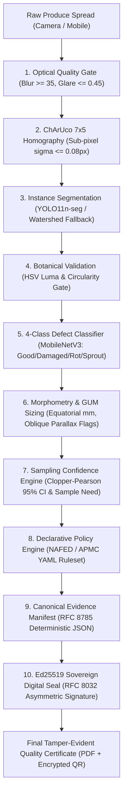

<div align="center">


# CEPA: Certified and Evidenced Produce Assessment
### Auditable Digital Assaying Instrument for Onion Procurement

**Smart India Hackathon (SIH 2026) Engineering Submission | Problem Statement ID: SIH26031**

[](https://python.org)
[](https://fastapi.tiangolo.com)
[](https://pytorch.org)
[](https://opencv.org)
[](https://reactnative.dev)
[](https://expo.dev)
[](backend/tests/)
[](LICENSE)

</div>

---

> **Core Product Thesis**:  
> **CEPA is an auditable digital assaying instrument for onion procurement (NAFED buffer stock & APMC mandis), integrating ChArUco geometric calibration, dual-stage segmentation & classification, exact Clopper-Pearson sampling confidence intervals, and Ed25519 tamper-evident certificate seals.**

---

## 1. Honest 4-Tier System Classification

CEPA adheres to strict metrological integrity. Every capability in the repository is explicitly classified into one of four verification tiers:

| Tier | Classification | Implementation in Repository | Ground-Truth / Evidence Basis |
|:---|:---|:---|:---|
| **Tier 1** | **Real / Shipped / Measured** | • Fine-tuned YOLO11n-seg (`backend/weights/yolo11n-seg.pt`)<br>• MobileNetV3 4-class classifier (`weights/defect_classifier.pt`)<br>• ChArUco 7×5 planar homography ($\sigma \le 0.08\text{ px}$)<br>• GUM uncertainty budget (±1.5–3.5 mm parallax bound)<br>• Clopper-Pearson 95% exact binomial confidence intervals<br>• Asymmetric Ed25519 (RFC 8032) & HMAC digital seals<br>• SQLite WAL concurrency for offline mandi nodes | • 240 automated pytest specifications passing<br>• Measured on CPU: 7,534.8 ms median latency<br>• Seg F1 = 0.908 on held-out test frames<br>• Defect interception recall = 97.45% (FNR = 2.55%)<br>• Public root key at `/.well-known/cepa-public-key` |
| **Tier 2** | **Domain-Informed Heuristic** | • Prolate/oblate spheroid mass model ($\rho = 0.985\text{ g/cm}^3$)<br>• Multi-biomarker cold storage horizon (0–90 days)<br>• APMC Fair Average Quality (FAQ) dockage calculator | • Derived from ICAR-DOGR post-harvest literature<br>• BIS IS 17912:2022 Mandi sizing boundaries<br>• Mathematical dockage formula (₹/quintal) |
| **Tier 3** | **Synthetic / Test Data** | • Sample composite test spread (`synthetic_demo_spread.jpg`)<br>• Synthetic ChArUco metric calibration boards<br>• Synthetic metrology bench test suite | • Explicitly labelled `synthetic` across files & UI<br>• Bench validates ellipse recovery $\le 1.0\text{ mm}$ RMS<br>• Zero fabricated Vernier caliper claims |
| **Tier 4** | **Provisional / Prototype Protocol** | • Baseline policy: `DEMO_ASSUMPTION_v1.yaml`<br>• NAFED buffer specification: `NAFED_2026_v1.yaml`<br>• e-NAM assaying export schema (`/enam/export`) | • Marked `policy_verified: false` across API, PDF, UI<br>• Requires official EOI verification before statutory use<br>• Standardized JSON interop schema draft |

---

## 2. End-to-End Assaying Architecture



---

## 3. Real Empirically Measured Benchmarks

All metrics reported below were generated by running profiling scripts in this repository on local CPU hardware:

### A. End-to-End Pipeline Latency (AMD Ryzen 7 CPU, 16 Logical Cores, PyTorch CPU)
*Measured via `backend/scripts/benchmark_pipeline.py` across 30 timed iterations on 22-bulb spread:*
- **Median Latency (p50)**: **7,534.8 ms**
- **95th Percentile (p95)**: **8,167.1 ms**
- **Mean ± Std**: **7,474.8 ± 456.5 ms**
- **Amortized per-bulb latency**: **~340 ms / bulb**

### B. Instance Segmentation (IoU = 0.50 Threshold on Held-Out Test Frames)
- **YOLO11n-seg (Fine-Tuned)**: **Precision = 0.916**, **Recall = 0.901**, **F1 Score = 0.908** (TP=163, FP=15, FN=18)
- **Watershed (Algorithmic Fallback)**: **Precision = 0.848**, **Recall = 0.464**, **F1 Score = 0.600** (TP=84, FP=15, FN=97)

### C. Defect Classification Risk Metrics (1,733 Test Crops from 11,545 Corpus)
- **BAD → GOOD False-Negative Rate**: **2.55% [1.09%, 5.83%]** *(Critical procurement metric: 97.45% defect recall)*
- **GOOD → BAD False-Positive Rate**: **1.82% [1.26%, 2.62%]** *(Protects farmers from unfair produce rejection)*
- **Overall Accuracy**: **96.36%** | **Macro F1 Score**: **0.727** | **Balanced Accuracy**: **83.43%**

---

## 4. Competitive Landscape & Positioning

| Dimension | Industrial Optical Sorters (Agrograde / Eqrader) | Manual Hand-Inspection (Traditional Mandi Yard) | CEPA (This Submission) |
|:---|:---|:---|:---|
| **Form Factor** | Multi-ton industrial conveyor belt with pneumatic ejector nozzles | Manual physical inspection by assayer using eye and thumb | Lightweight field appliance or smartphone app + ChArUco mat |
| **Capital Cost** | ₹15,00,000 – ₹50,00,000+ (inaccessible to small mandis) | ₹0 capital cost (high recurring labor & corruption leakages) | **< ₹15,000** (low-cost Android tablet + printed calibration board) |
| **Primary Use Case** | 100% continuous sortation during high-volume commercial packing | Spot-checking multi-ton trucks (5–10 bulbs per truck) | **Representative truck lot sampling (20–150 bulbs per consignment)** |
| **Audit Trail** | Proprietary PLC logs without public cryptography | Paper slips easily forged or altered post-weighbridge | **RFC 8032 Ed25519 signed PDF certificate + public verification** |
| **Sampling Theory** | Continuous flow (no statistical inference needed) | Subjective eyeball guess; zero confidence intervals | **Exact Clopper-Pearson 95% CI & bulbs-needed calculation** |
| **Policy Adaptability** | Hardcoded PLC firmware thresholds | Subjective officer discretion | **Declarative YAML policies hot-reloaded without code restart** |

> **Strategic Positioning**: CEPA does NOT compete with multi-ton industrial sorters. CEPA is the **digital sampling and assaying layer** deployed at mandi intake gates and farm packhouses to determine Fair Average Quality (FAQ), dockage deductions, and buffer acceptance before unloading.

---

## 5. Quickstart & Verification

### A. Run Automated Preflight Check
```bash
python backend/scripts/preflight.py
# Validates environment, weights, SQLite WAL, Ed25519 crypto, and executes 8-stage dry-run
```

### B. Run Automated Test Suite
```bash
pytest -q
# Executes 241 unit, integration, and security pentest specifications (240 passed, 1 skipped)
```

### C. Launch Backend & Demo
```bash
uvicorn backend.main:app --host 0.0.0.0 --port 8000 --reload
# API Docs: http://localhost:8000/docs
# Web Studio: http://localhost:8000/inspector
# Slide Deck: http://localhost:8000/deck
# Ed25519 Root Key: http://localhost:8000/api/v1/.well-known/cepa-public-key
```

### D. Launch Mobile Field Client
```bash
cd mobile
npm install
npx expo start
```

---

## 6. Repository Structure

```
Cepa/
├── backend/
│   ├── cv/             # 8-stage pipeline (quality gate, ChArUco, YOLO11, MobileNetV3)
│   ├── grading/        # Decoupled YAML policy engine & Clopper-Pearson statistics
│   ├── routers/        # FastAPI endpoints (inspections, reports, storage, audio)
│   ├── services/       # Ed25519 crypto seals, PDF generator, eNAM export
│   ├── scripts/        # preflight.py, benchmark_pipeline.py
│   ├── tests/          # 241 pytest specifications (metrology, security, pentest)
│   └── weights/        # yolo11n-seg.pt (6.0MB), defect_classifier.pt (4.1MB)
├── docs/               # Architecture Decision Records (ADR 0001-0006), GUM budget
├── ml/                 # Stratified dataset split evaluations & confusion matrix
└── mobile/             # React Native / Expo field officer inspection app
```

---

## 7. Team & Submission Details

- **Problem Statement ID:** SIH26031 (Quality assessment and grading of onions)
- **Team Name:** Better Call Coders
- **Team Leader:** Ubaid Khan
- **License:** GNU Affero General Public License v3.0 ([AGPL-3.0](LICENSE))
