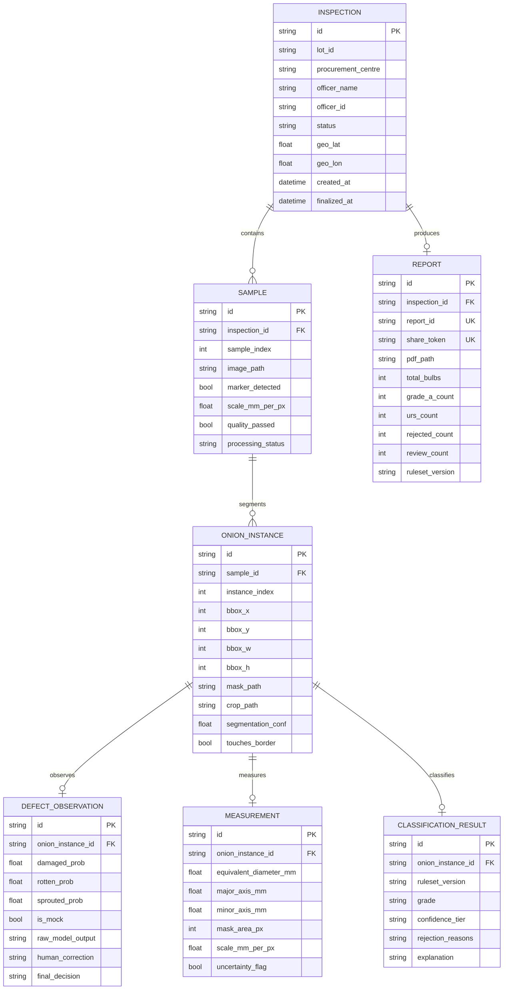

# Cepa System Architecture (SIH26031)

## 1. Executive Summary & Design Invariants

Cepa is an AI-powered onion quality inspection and grading system built for agricultural procurement officers (e.g., NAFED, NCCF, APMC mandis).

### Key Architectural Invariants
1. **Separation of Physical Observations from Procurement Policy**: The Computer Vision pipeline detects and measures physical properties (size in mm, mask area, defect probabilities, border occlusion). The Grading Policy Engine evaluates these observations against versioned procurement rules (YAML). The CV models never output "Grade A" or "Rejected" directly.
2. **Deterministic Audit Trail**: Every final lot grade is traceable to individual sample photographs, to individual onion crops, to binary masks, to geometric pixel measurements, to sigmoid defect probabilities, and to the active YAML policy version.
3. **Honest System Boundaries**: Internal rot invisible to the camera is explicitly documented as undetectable. 2D top-down area-derived diameter is clearly documented as a projected measurement, not a 3D caliper measurement.
4. **Resilient Threading Model**: Heavy ML inference and image processing run in dedicated thread pools (`ThreadPoolExecutor`) outside the async event loop to prevent server lockup.

---

## 2. Component Diagram

```mermaid
flowchart TD
    subgraph Mobile [Officer Mobile Device (Expo React Native)]
        UI[Mobile App UI]
        Cam[Camera + ChArUco Guide]
        GPS[GPS Coordinates Provider]
        Offline[Offline Draft Queue]
    end

    subgraph Backend [Cepa Backend (FastAPI)]
        Router[REST API Layer]
        Pool[ThreadPoolExecutor]
        DB[(SQLite / PostgreSQL)]
        Storage[(Local Storage / S3)]
    end

    subgraph CV_Pipeline [8-Stage CV Pipeline]
        QG[Stage 1: Image Quality Gate]
        Marker[Stage 2: ChArUco Detection]
        Calib[Stage 3: Scale & Perspective Rectification]
        Seg[Stage 4: Instance Segmentation - YOLO11]
        Crop[Stage 5: Mask & Crop Extraction]
        Defect[Stage 6: Multi-Label Defect Classifier]
        Size[Stage 7: Geometric Size Estimator]
        Conf[Stage 8: Confidence Tier Assessment]
    end

    subgraph Engine [Policy Engine]
        YAML[YAML Policy: DEMO_ASSUMPTION_v1]
        Grading[Rules Evaluator]
        Agg[Lot Aggregator]
        PDF[ReportLab PDF Generator]
    end

    UI -->|1. Capture + GPS| Router
    Router -->|2. Offload Sync Task| Pool
    Pool --> QG
    QG --> Marker
    Marker --> Calib
    Calib --> Seg
    Seg --> Crop
    Crop --> Defect
    Crop --> Size
    Defect --> Conf
    Size --> Conf
    Conf --> Grading
    YAML --> Grading
    Grading --> Agg
    Agg --> DB
    Crop --> Storage
    Agg --> PDF
    PDF --> Storage
    Router -->|3. Structured Evidence JSON| UI
```

---

## 3. Database Entity-Relationship Model



---

## 4. Architectural Decision Records (ADRs)

### ADR 1: Python FastAPI Monolith over Microservices
- **Context**: Hackathon proof-of-concept required rapid, deterministic, and reliable execution.
- **Decision**: Single FastAPI service handling both the REST API and the synchronous CV pipeline execution via thread pools.
- **Trade-off**: Simpler deployment (single process / container), zero IPC overhead, SQLite-ready, easy horizontal scaling later via Celery/Redis if required.

### ADR 2: YOLO11-seg Instance Segmentation
- **Context**: Bulbs frequently touch, cluster, and partially occlude each other in representative spreads.
- **Decision**: Ultralytics YOLO11s-seg (with YOLO11n-seg CPU fallback).
- **Rationale**: C2PSA (Cross-Stage Partial with Spatial Attention) architectural blocks significantly outperform generic bounding-box detectors on touching spheroid boundaries.

### ADR 3: ChArUco Calibration Board over Plain ArUco
- **Context**: Sizing requires millimeter-level accuracy from varying smartphone capture heights (50–90 cm).
- **Decision**: ChArUco 7x5 board with 40mm squares and 20mm markers (DICT_4X4_250).
- **Rationale**: Sub-pixel saddle point detection prevents pixel quantization error. Partial occlusion resilience ensures scale can be extracted even if an onion slightly touches the board edge.

### ADR 4: Decoupled Multi-Label Defect Classification
- **Context**: Agricultural defects are not mutually exclusive. A bulb can be damaged, rotten, and sprouted simultaneously.
- **Decision**: Sigmoid-based multi-label binary probabilities rather than a single Softmax classification.

### ADR 5: Versioned YAML Procurement Policies
- **Context**: Government procurement guidelines (e.g. NAFED PSF buffer stock) evolve seasonally (e.g. URS relaxation).
- **Decision**: Hardcoding thresholds in Python was prohibited. Policies live in `backend/grading/policies/*.yaml` and are referenced in every inspection result and PDF report.
