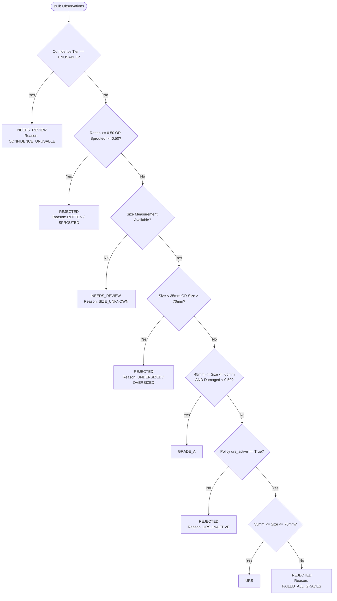

# Cepa Grading Rules Engine Documentation

## 1. Domain Logic & NAFED Procurement Standards

In India, onion procurement under the Price Stabilisation Fund (PSF) and market interventions (NAFED/NCCF) enforces strict quality and grading specifications to protect buffer stock longevity in cold and ventilated storage.

### Grading Specifications Comparison

| Parameter | NAFED Grade A (Verified) | NAFED URS (Under Relaxed Spec - Seasonal) | Rejection Standard |
|---|---|---|---|
| **Equatorial Diameter** | $45\text{ mm} - 65\text{ mm}$ | $35\text{ mm} - 70\text{ mm}$ | $< 35\text{ mm}$ or $> 70\text{ mm}$ |
| **Visible Rot / Decay** | $0\%$ tolerance (Hard Rejection) | $0\%$ tolerance (Hard Rejection) | Any detected rot $\rightarrow$ REJECTED |
| **Sprouting** | $0\%$ tolerance (Hard Rejection) | $0\%$ tolerance (Hard Rejection) | Any detected sprout $\rightarrow$ REJECTED |
| **Mechanical Damage** | Minor / negligible ($\le 5\%$) | Permitted up to relaxed threshold | Severe damage exceeding limits |
| **Status of Instrument** | Standing benchmark | Seasonal / Emergency relaxation | Rejection applies across all grades |

---

## 2. Policy Versioning System

Procurement rules are maintained in YAML format under `backend/grading/policies/`:

### Active Policy: `DEMO_ASSUMPTION_v1.yaml`
```yaml
version: "DEMO_ASSUMPTION_v1"
label: "Demo Assumptions — NOT official NAFED/NCCF procurement specification"
verified: false
urs_active: true

size:
  grade_a_min_mm: 45.0
  grade_a_max_mm: 65.0
  urs_min_mm: 35.0
  urs_max_mm: 70.0

defect_thresholds:
  damaged_threshold: 0.50
  rotten_threshold: 0.50
  sprouted_threshold: 0.50

hard_rejection:
  rotten_always_rejected: true
  sprouted_always_rejected: true
  below_urs_min_always_rejected: true
  above_urs_max_always_rejected: true
```

### Policy Traceability
Every generated inspection record, database entry, API response, and PDF report explicitly states:
1. `ruleset_version` (e.g. `DEMO_ASSUMPTION_v1`)
2. `verified` boolean flag (`true` only when corroborated with an official signed NAFED circular)
3. Full explanatory breakdown of why each individual onion was assigned its grade.

---

## 3. Evaluation Cascade Algorithm

The rules engine evaluates each bulb through a sequential decision tree:


